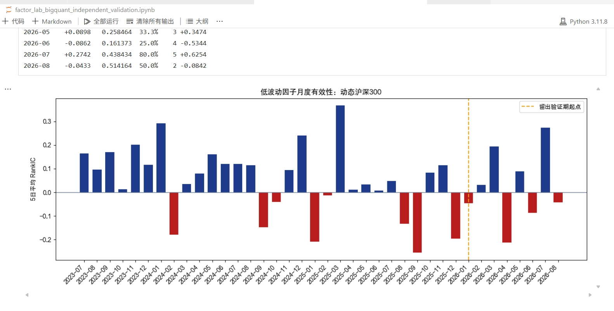
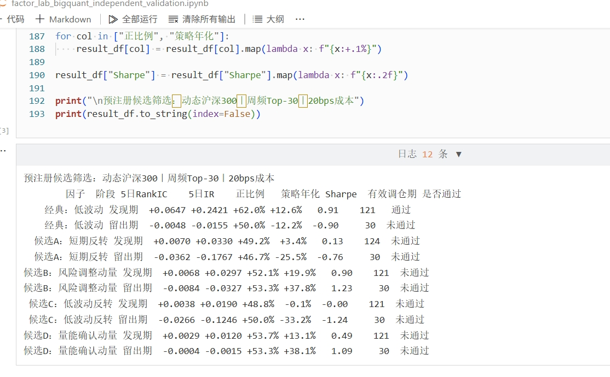

# BigQuant 独立验证记录

> 目的：检验本地工作台生成的候选是否能经受独立数据环境与预先划定留出期的检验。该记录不构成投资建议，也不将任一候选宣称为可交易信号。

## 1. 验证设计

- **环境**：BigQuant 为 AFAC 参赛者提供的独立沙箱；A 股历史日线与平台计算环境。
- **股票池**：动态沪深300成分股。每个交易日以 `is_hs300 = 1` 过滤，日志显示每日 300 只。
- **样本**：2023-06-01 至 2026-08-21。
- **策略规则**：调仓日按因子排序选择 Top-30，周频调仓，双边成本 20bps。
- **预测口径**：调仓日因子值与未来 5 个交易日收益计算 RankIC；策略按下一交易日成交口径模拟。
- **筛选规则**：先冻结候选公式，再按发现期（2023-06 至 2025-12）与留出期（2026-01 至 2026-08）分别检验；只有两段均满足预设 RankIC、IR、正比例、策略年化与 Sharpe 门槛才接纳。留出期不继续用于挖掘新公式。

## 2. 放量延续：跨环境复核后淘汰

候选公式为：`rank((5日平均成交量 / 20日平均成交量) × 5日收益)`。

| 口径 | 结果 | 结论 |
|---|---|---|
| 本地 baostock 样本内周频 Top-30 | 年化 +14.4%，Sharpe 0.53 | 仅用于工作台流程演示 |
| BigQuant 动态沪深300，5 日 RankIC | +0.0061，IR +0.0304，正比例 53.3% | 信号过弱 |
| BigQuant 动态沪深300，周频 Top-30 | 年化 −2.45%，Sharpe −0.10，最大回撤 −33.27% | **淘汰** |

结论：本地样本内收益不能替代独立复核。工作台保留该候选的表达式、体检与淘汰轨迹，而不把它升级进候选库。

## 3. 经典低波动：发现期有效，留出期转弱

低波动表达式为：`rank(-std(1日收益, 20日))`。

| 阶段 | 5 日 RankIC | 5 日 IR | 正比例 | 策略年化 | Sharpe | 判定 |
|---|---:|---:|---:|---:|---:|---|
| 发现期（2023-06 至 2025-12） | +0.0647 | +0.2421 | 62.0% | +12.6% | 0.91 | 通过 |
| 留出期（2026-01 至 2026-08） | −0.0048 | −0.0155 | 50.0% | −12.2% | −0.90 | 未通过 |

*图 1：BigQuant 原始运行截图。橙色虚线为留出验证期起点；2026 年月度 5 日 RankIC 正负交替，说明该因子存在市场状态依赖。*

## 4. 预注册候选筛选：0 / 5 通过双阶段门槛

候选包括低波动、短期反转、风险调整动量、低波动反转、量能确认动量。低波动仅在发现期通过；其余候选在发现期或留出期至少一段未达到门槛，最终没有候选同时通过两段筛选。

*图 2：BigQuant 原始运行截图。预注册候选筛选的完整输出；最终结果为 0 / 5 通过。*

## 5. 可复现与边界

- BigQuant Notebook 名称：`factor_lab_bigquant_independent_validation.ipynb`。
- 本地代码仓库保留受限 DSL、体检与本地策略流程；BigQuant 用于独立环境复核。
- 该批留出期已冻结，不再据此继续搜索新公式；后续仅用新的样本外数据累积证据。
- 固定成本并不等于完整实盘模拟；滑点、冲击成本、资金容量仍需后续补充。
