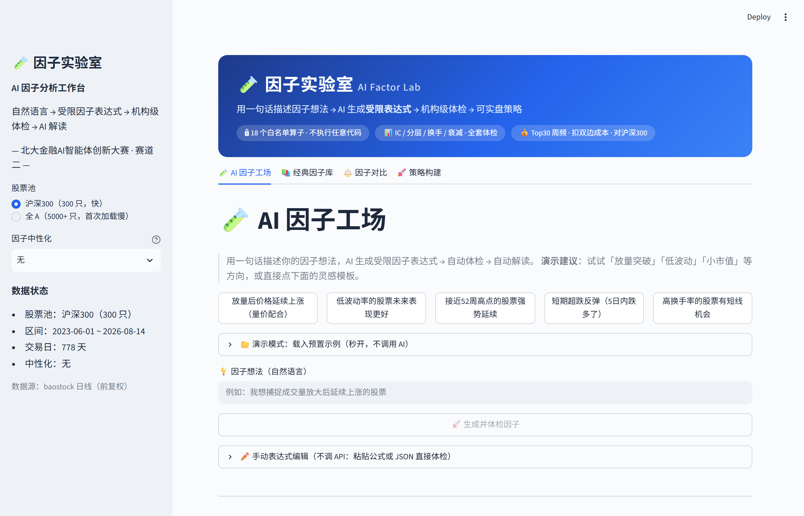

# 因子实验室（AI Factor Lab）—— 让 AI 安全地挖掘 A 股因子

---

## 摘要

**AFAC 金融智能创新大赛 · 方向二：量化投资策略与金融科技工具研发**
*北京大学 · CCF 中国计算机学会 · 蚂蚁集团 · NVIDIA 等 30 余家高校与金融科技龙头联合主办*

**一句话**：一个让 AI 在安全约束内挖掘 A 股因子的研究实验工作台——「受限智能体（Constrained Agent）」范式：LLM 的创意空间被压缩为 18 个金融原子算子，从结构上杜绝任意代码执行与数据越权。

- **痛点**：因子研究有两道门槛——「把想法翻译成代码」（生成门槛）与「验证因子是否有效」（验证门槛）；LLM 直接写代码又带来注入与失控风险；
- **方案**：自然语言想法 → 受限表达式树 → 量化研究标准体检（IC/分层/换手/衰减/评分）→ **反思迭代闭环**（不达标自动回喂修改重检）→ Top-N 策略，全链路可解释、可手动干预、可复现；
- **关键实证（2026-08 真实 baostock 数据）**：AI 因子 3 年策略年化 **+14.4% vs 沪深300 +8.2%**；AI 独立挖出的低波动因子与经典因子库表达式**完全一致**——可信度互证；11 因子同规则 PK 中跑赢 5/10 个教科书因子；
- **创新**：结构性安全 DSL（对比 RD-Agent/Qlib 的约定式安全）；一切因子走同一验证管线；生命周期图如实标注失效；智能体反思迭代闭环；
- **价值**：面向 A 股个人研究者的开箱即用工作台——双股票池、本地运行、免费数据源；**v0.9 已于 2026-08 开源（github.com/Yumm-del/factor-lab）**，任何人现在即可下载复现。

> **风险声明**：本工具仅为量化研究实验工作台，所有回测结果为历史数据模拟，不构成任何投资建议；历史回测收益不能保证未来表现，实盘还需额外考虑滑点、冲击成本与资金容量。

---

## 一、项目背景

### 1.1 痛点：因子研究的两道门槛

多因子选股是量化投资的基本功，但传统因子研究存在两道高门槛，把大量潜在研究者挡在门外：

**生成门槛（写得出吗）**。一个可用的因子 = 金融逻辑 + 工程实现，二者缺一不可。研究员 80% 的时间花在「把想法翻译成代码并调试」，而不是思考逻辑本身。大模型的出现让「自然语言 → 代码」成为可能，但直接用 LLM 写因子代码面临**安全与失控**风险：自由代码执行意味着把回测系统交给不可控的文本生成器——数据注入（偷看未来数据）、任意文件操作、资源耗尽都防不胜防。安全约束一旦是「约定」而非「结构」，就会出事故。

**验证门槛（信得过吗）**。新手（和 AI）挖出的因子经常「回测好看、实盘失效」。原因不是回测本身有 bug，而是缺少量化研究标准的统计检验闭环：IC 是否显著？分层是否单调？换手率是否吃掉收益？信号衰减多快？风格切换时是否失效？**没有这套闭环，AI 挖因子就是赌博**——这也是大量「AI 量化」demo 止步于展示的根本原因。

### 1.2 现状调研（2026-08）

- 方向可行性已获验证（2026-08 核实）：微软 Qlib + RD-Agent（GitHub 36k/12k stars）已实现「LLM 因子挖掘 + 自动回测验证」闭环（NeurIPS 2025），QuantaAlpha、EasyQuant 等亦在探索——但普遍采用「**LLM 生成自由代码 + 回测防火墙**」路线：安全依赖语法检查与测试约束，是**约定**而非**结构**保证；且大多面向美股/加密市场与专业数据环境；
- 商业平台：聚宽免费版可用但受限（回测单线程、因子库仅基础 100+、数据 15 分钟延迟），完整能力年费 999-2799 元；Wind 面向机构、封闭昂贵；
- 结论：**面向 A 股个人研究者、以「结构性安全 DSL + 全流程可解释 + 本地开箱即用」为目标的工作台仍缺位**——本项目以 18 个白名单算子组成的受限表达式树为安全地基，补上这一环。

### 1.3 项目目标

构建一个 **AI 因子分析工作台**：用户用一句话描述因子想法，系统完成「受限表达式生成 → 量化研究标准体检 → 因子解读 → 策略验证」的完整闭环，全程可解释、可手动干预、用真实 A 股数据验证。回答一个核心问题：**AI 能不能挖出真能用的 A 股因子？**

## 二、项目概述与成果摘要

### 2.1 解决方案

**范式定调**：本项目提出「受限智能体（Constrained Agent）」范式——在量化投研这一高合规性场景中，智能体的自由度必须被数学结构绑定。LLM 的创意空间被压缩为 18 个金融原子算子：既有探索能力，又从结构上杜绝任意代码执行与数据越权。实证上，受限智能体独立挖掘出的低波动因子与经典因子库内置表达式**完全一致**——机器"重新发现"了教科书结论，金融直觉获得可信度互证。

「因子实验室」把两端门槛同时解决：

```
一句话想法 ──LLM──▶ 受限因子表达式 ──自动──▶ 量化研究标准体检 ──LLM──▶ 中文报告 ──▶ Top-N 策略
"放量后延续上涨"      rank(量比5/20 × 动量20)    IC/RankIC · 5层分层   结论·风险·建议   扣成本·对沪深300
                      ↓ 18 个白名单算子          换手 · 衰减 · 评分       + 表达式树可视化   + 全因子策略 PK
                      （结构上无法执行任意代码）   综合评分(0-100)
```

### 2.2 关键成果（2026-08 实测，真实 baostock 数据）

- **AI 因子跑赢 5/10 个经典教科书因子**：AI 挖出的「放量延续」因子 3 年策略年化 **+14.4%**（同期沪深300 +8.2%，超额 +6.0%），在 11 因子全量 PK 中排名第 6；
- **AI 与教科书殊途同归**：AI 独立挖出的低波动因子表达式与经典因子库内置表达式**完全一致**——可信度互证；
- **双股票池**：沪深300（300 只）+ 全 A 股（5000+ 只），支持行业/市值中性化；
- **全链路可解释**：表达式树、因子逻辑自述、体检报告、因子生命周期图——每一步都有「为什么」；
- **已开源**：v0.9 于 2026-08 发布（GitHub: Yumm-del/factor-lab，MIT License）——「可复现」从承诺变事实，复现入口与已知边界在仓库 README 公开。

## 三、产品功能

工作台为 Streamlit 单页应用，四个主 Tab + 侧边栏数据面板：

| 页面 | 功能 |
|---|---|
| 🧪 **AI 因子工场** | 一句话想法 → LLM 生成受限表达式 → 全套体检 → AI 解读报告 |
| 📚 **经典因子库** | 10 个教科书因子（低波动/动量/价值/流动性等）一键体检 |
| ⚖️ **因子对比** | 全部因子评分榜 + **策略层 PK**（11 条净值同屏） |
| 🚀 **策略构建** | 任意因子 → Top-30 周频组合 → 与沪深300 指数对比 |

三个扩展功能：

1. **手动表达式编辑**：支持直接输入人类可读公式（如 `rank(ts_mean(close,5)/ts_mean(volume,20))`）或 JSON 表达式树，内置递归下降解析器，不依赖 API 即可完成体检——参数可现场修改、即时复验；
2. **双股票池 + 行业/市值中性化**：侧边栏一键切换池子与中性化方式（无/行业/行业+市值），剥离「选股其实在选行业/选大小盘」的混淆；
3. **策略层 PK**：全部因子用同一回测规则（Top30、周频、双边 20bps、同一指数基准）同屏对比——「谁行谁不行」压到一张表上。

**工作台界面实测**（AI 因子工场，2026-08 实拍渲染）：下图为载入预置示例「低波动率的股票未来表现更好」后的即时状态——全程离线演示（不调用 AI API），验证通过即现算体检：



*图 3-1：AI 因子工场实测界面（2026-08 渲染，baostock 前复权样本）。页面自上而下为：灵感模板 → 演示模式入口 → AI 生成的受限因子表达式（解析校验通过）→ 综合评分与 IC/换手指标 → 分层回测与 IC 衰减图表。「一句话想法 → 体检报告」完整体检分钟级内可查（沪深300 池约 15–40s，全 A 池约 30–150s，实测），每一步可点击展开。*

## 四、技术方案

### 4.1 系统架构

```
┌─────────────┐    ┌──────────────────┐    ┌──────────────────┐    ┌──────────────┐
│  数据管道    │───▶│   因子 DSL        │───▶│   验证引擎        │───▶│   策略构建    │
│  baostock   │    │  18 算子白名单    │    │  IC/分层/换手/衰减│    │  Top-N 组合   │
│  双池 3 年    │    │  表达式树/求值    │    │  综合评分(0-100)  │    │  成本/基准对比 │
│  行业中性化   │    │  公式解析器       │    │  行业/市值剥离     │    │               │
└─────────────┘    └─────────▲────────┘    └─────────▲────────┘    └──────────────┘
                             │                      │
                     ┌───────┴────────┐    ┌────────┴───────┐
                     │  LLM 因子生成   │    │  LLM 解读报告   │
                     │  自然语言→JSON  │    │  数字→人话     │
                     └────────────────┘    └────────────────┘
                              （DeepSeek API，JSON 校验 + 深度/节点限制 + 反思迭代）
```

技术栈：Python 3.14 / pandas（向量化）/ numpy / baostock / Streamlit / plotly / DeepSeek API。

### 4.2 数据管道

- **双股票池**：沪深300 成分股（300 只，机构核心池）与全 A 股（5320 只，2026-08 扩展），3 年日线（778 个交易日，2023-06-01 ~ 2026-08-14），baostock 前复权数据，字段含 close/high/low/volume/amount/turn/peTTM/pbMRQ + 沪深300 指数（策略基准）；
- **长表 → 宽面板**：以 (date, code) 多级索引 unstack 成 date × code 面板，因子 DSL 按截面/时序两轴向量化计算；
- **行业映射**：申万一级行业（code → 行业），中性化前置依赖；
- **基本面数据源（可扩展）**：巨潮资讯网为证监会指定的上市公司信息披露平台（深圳证券信息有限公司运营，法定披露免费公开），定期报告与公告即盈利收益率、账面市值比等基本面因子的原始来源——数据层预留该接入点，与 baostock 行情形成「行情 + 披露」双源闭环；
- **工程加固（免费数据源的容错设计）**：baostock 为免费公共服务器，实测深夜存在长时间不可用窗口。管道实现断点续传（已下载股票跳过）、全链路线程超时保护（socket 无超时，卡死会无限阻塞——所有 baostock 调用包裹线程 join 限时）、自动重连与「断连原地等待恢复」（60 秒探测）、失败股票补录轮——**数据安全不因服务波动而丢失**。

### 4.3 受限因子 DSL（安全地基）

**设计动机**：LLM 生成因子有两个路线——(a) 生成 Python 代码再执行（不安全）；(b) 生成受限表达式再求值（安全）。本项目选择 (b)：**AI 有创造空间，但没有越权空间**。

- **18 个白名单算子**：

| 类别 | 算子 | 说明 |
|---|---|---|
| 时序 (8) | `ts_returns` / `ts_mean` / `ts_std` / `ts_zscore` / `ts_rank` / `ts_max` / `ts_min` / `delay` | 窗口滚动计算，窗口 2~260（支持 52 周高点类因子） |
| 截面 (2) | `rank` / `normalize` | 每日横截面排序/标准化 |
| 二元 (4) | `add` / `sub` / `mul` / `div` | 表达式组合 |
| 一元 (4) | `neg` / `abs` / `log` / `signed_power` | 变换 |

- **表达式树**：因子是 JSON 树（如 `{"op":"mul","args":[{"op":"rank",...},...]}`），数据叶子直接引用字段（close/volume/...），`const` 只接受数值；
- **结构安全**：深度上限 8、节点上限 64、算子白名单——非法输入在**解析层**被拦截（中文报错），LLM 输出经 JSON Schema 校验 + 超限自动重试；
- **人类可读公式解析器**：递归下降解析器把 `ts_returns(close, 20) + 1` 这类公式转为与 LLM JSON 同构的表达式树——**AI 生成的、手动输入的、经典库内置的，最终都是同一棵树，走同一套验证**。

**已有 vs 新增（原创性边界）**：因子分析管线（IC/分层/换手/衰减）是行业标准做法（alphalens 等同类库已有），不宣称原创；本项目的增量在于——① 把「LLM 生成」与「受限表达式」接合为**结构式安全**地基（对比 RD-Agent「LLM 写代码 + 回测防火墙」的约定式安全）；② 经典因子对照组 + 生命周期如实标注，让验证管线本身可被信任；③ 面向 A 股个人研究者的开箱即用工作台（双池、离线可演示）。

### 4.4 验证引擎（量化研究标准体检）

全部因子（经典/AI/手动输入）走完全相同的验证流水线：

1. **IC / RankIC**：每日截面计算**当日因子值 vs T+1 收益**的相关系数（Pearson IC + Spearman RankIC）——因子只用 T 日及以前数据、收益取 T+1，**天然错开一天，从底层杜绝任何形式的未来函数**（免费数据源常见的前复权陷阱、次日数据缺失同样受检）；输出时序、均值、标准差、IR（均值/标准差）、t 值、IC 为正天数占比；
2. **5 层分层回测**：每交易日按因子值 qcut 分 5 层，等权日调仓，输出各层累计净值、年化收益、**多空组合（L1−L5）净值**与层间单调性指标——「因子值高是否真的涨得多」；
3. **组合换手率**：分层组合的日均换手，判断交易成本是否会吃掉收益；
4. **IC 衰减曲线**：因子对未来 1~10 日收益的预测力衰减——短线还是长线信号；
5. **综合评分（0-100）**：IC 强度 30 + 信息比率 25 + 多空年化 30 + 层间单调性 15，各分量经 **tanh 压缩**（极端值封顶，防止过拟合因子刷分）；判定三档（优秀/可用/淘汰）并标注因子方向（正/反）；
6. **评分窗口**：默认近 252 个交易日（量化行业滚动评估惯例）+ **因子生命周期图**（全样本 60 日滚动 IC）——风格切换导致因子失效时**如实画出**，不粉饰。

### 4.5 中性化（剥离行业/市值混淆）

因子值里往往混着行业与市值成分——「低波动」因子天然偏向银行/公用事业（低波动行业），直接用等于在押注行业而非因子能力。中性化 = 每个交易日截面上，因子值对**行业哑变量 + log(流通市值)** 做最小二乘回归（numpy lstsq），取残差作为新因子值：

```
F_resid = F_raw − X·β        （X：申万一级行业哑变量 + 对数流通市值）
```

行业/市值可解释的部分被剥离，残差 F_resid 即为「与行业市值无关的纯因子信号」。

**市值代理的误差边界**：流通市值用 `成交额/换手率` 近似（流通市值 = 成交额 ÷ 换手率 的理论关系）——换手率是按流通股本计算的，故该比值在数学上恒等于流通市值；实际误差来自数据口径（换手率四舍五入、停牌日异常值），属量级可忽略的噪声。取该代理是为免引入额外数据源，接口已抽象，后续可直接替换为真实流通市值字段。

### 4.6 策略构建（因子的最后一公里）

- **组合规则**：Top-30 等权组合、每 5 个交易日调仓（周频）、双边成本 20bps；
- **基准**：真实沪深300 指数（sh.000300）；
- **指标**：年化收益/波动/Sharpe/最大回撤/平均换手/超额年化/信息比率/胜率；
- **策略层 PK**：全部因子同一规则回测，净值同屏 + 指标表——「体检是门槛，真金白银是结果」。

### 4.7 LLM 编排

- **因子生成**：自然语言想法 + 算子说明提示词 → DeepSeek API → JSON 表达式树，经 JSON Schema 校验、深度/节点数限制，非法输出自动重试（最多 3 次）；
- **反思迭代闭环（自主性来源）**：体检评分 <50（淘汰档）时自动触发反思——把失败诊断（IC 强度/换手率/分层单调性/衰减速度）回喂 LLM，LLM 基于体检证据修改表达式结构（加长窗口平滑、调整组合方式等）后重新体检，最多迭代 2 轮；每轮的表达式与评分完整保留为可追溯的迭代轨迹——「AI 挖因子」从单轮生成升级为自主迭代闭环：AI 负责「想」，体检负责「判」，人负责「审」；
- **解读报告**：体检数字 → 中文报告（因子画像/结论/指标/风险与改进建议）；
- **离线兜底**：预置示例（presets.json），API 不可用时演示故事不中断。

**选型论证**：因子生成是「创意发散 + 规则约束」的混合任务——创意部分适合 LLM（自然语言输入、几十种表达式变体探索），约束部分适合**结构保证**而非事后审查。对比纯人工写公式（门槛高、探索慢）与 LLM 写自由代码（注入/失控风险），本方案取中间路线：**LLM 负责「想」，结构负责「拦」**。模型选 DeepSeek：生成任务输出短（一个 JSON 树）、失败可重试，**小模型即可胜任、成本比旗舰模型低一个量级**；LLM 层为接口抽象，可替换任意兼容模型，不绑定单一供应商。

## 五、创新点（差异化）

| # | 创新点 | 现状的问题 | 本方案的解法 | 证据 |
|---|---|---|---|---|
| 1 | **安全受限的因子 DSL** | RD-Agent/Qlib 等走「LLM 写 Python 代码 + 事后防火墙」，安全靠**约定**不靠结构 | 18 白名单算子 + 表达式树 + 深度/节点上限，**解析层拦截非法输入**（结构安全，非事后审查）；AI 有创造空间、没有越权空间 | 非法表达式中文报错；LLM 输出校验+重试 |
| 2 | **一切因子同一套体检管线** | 经典因子与 AI 因子各自为政，AI 因子的可信度无锚点 | 经典/AI/手动输入走同一流水线；经典因子是「已知答案的对照组」 | 工作台正确判定教科书因子（低波动 IC −0.036）；**AI 独立挖出的低波动因子与经典库表达式完全一致** |
| 3 | **全链路可解释** | AI 量化黑盒，「回测好看但不知道为什么」 | 表达式树可视化 + 因子逻辑自述 + 体检报告 + 生命周期图，每一步有「为什么」 | 生命周期图如实标注 2025-26 风格切换导致的失效 |
| 4 | **从因子到策略的闭环** | demo 止步于「生成了因子」，不回答「能赚多少」 | 扣成本、调仓、对真实指数对比；**策略层 PK** 全部因子同规则同屏对比 | 11 因子 PK：AI 因子 3 年 +14.4%，跑赢 5/10 经典因子 |
| 5 | **智能体反思迭代闭环** | AI 挖因子多是「单轮生成、不行就换想法」，无自主改进 | 体检评分 <50 自动触发反思：失败诊断回喂 LLM，LLM 基于体检证据修改表达式结构后重新体检，最多 2 轮；迭代轨迹（每轮公式+评分）完整保留 | 实测：淘汰档因子自动触发迭代，候选表达式逐轮变化（窗口平滑/组合结构调整），轨迹可追溯 |

## 六、实证结果

> 数据：沪深300 成分股 300 只 × 778 交易日（2023-06-01 ~ 2026-08-14），真实 baostock 数据，前复权；策略为 Top-30 周频、双边成本 20bps、对沪深300 指数；评分窗口近 252 个交易日。

### 6.1 经典因子对照（可信度验证）

| 因子 | 近1年 IC | 近1年评分 | 全样本 IC | 说明 |
|---|---|---|---|---|
| 低波动(20日) | −0.0363 | 60.8（可用） | −0.0026 | A 股最强异象之一；2023-24 有效(+0.02)、2025-26 成长行情反转(−0.02)，系统如实标注方向与生命周期 |
| 低换手(20日) | −0.0340 | 59.3（可用） | −0.0035 | 经典流动性异象，同样的风格轮动特征 |
| 60日动量(剔1日) | +0.0150 | 50.8（可用） | +0.0087 | **四年全样本 IC 均为正**——A 股中期动量稳健性的直接实证 |
| 20日动量 | +0.0142 | 56.1（可用） | +0.0059 | 动量弱正，符合 A 股特征 |
| 账面市值比(1/PB) | −0.0204 | 55.0（可用） | +0.0037 | 2023-24 价值风→2025-26 成长风切换，生命周期图一目了然 |

低波动的生命周期见下图——60 日滚动 IC 如实画出「有效 → 失效 → 回摆」的全过程：


*图 6-1：低波动因子 60 日滚动 IC（样本 2023-06-01 ~ 2026-08-14，baostock 前复权；浅黄 = 2025-26 风格切换期）。IC 走弱、失效段如实可见——系统不粉饰，标注即可信度。*

### 6.2 AI 因子（真实生成记录）

**示例 1：放量后价格延续上涨（量价配合）**

- AI 表达式：`rank(量比5日/20日 × 5日动量)`——放量确认 + 动量延续；
- 体检（近1年）：IC +0.0196 / 评分 66.4 / 可用；
- **3 年策略：组合年化 +14.4% vs 沪深300 +8.2%，超额 +6.0%，Sharpe 0.53**。


*图 6-2：AI 因子（放量延续）3 年策略净值 vs 沪深300（样本 2023-06-01 ~ 2026-08-14，baostock 前复权），与上表数字同源（2026-08 实测）。*

**示例 2：低波动率的股票未来表现更好**

- AI 独立挖出的表达式 `rank(neg(ts_std(ts_returns(close,1),20)))` **与经典因子库内置表达式完全一致**——AI 因子与教科书殊途同归，可信度互证；
- 体检（近1年）：IC −0.0363 / 评分 60.8 / 可用（方向标注为反向）；
- 3 年策略：年化 +9.0% vs 指数 +8.2%，回撤 −17.6% 显著低于指数。

**过滤能力（不粉饰失败）**：并非每次生成都直接达标——低分候选会被体检引擎如实淘汰，或进入反思迭代继续改进；反思测试中即出现调整不当、评分回落的轮次，系统如实保留每一轮轨迹。「生成 → 过滤 → 保留」的完整漏斗，才是真实研究工作流——工具的价值恰恰在把坏因子拦在策略层之外。

### 6.3 策略层 PK（全部因子同规则对比，2026-08 实测）

| 因子 | 类型 | 3年年化 | 超额 | Sharpe | 最大回撤 |
|---|---|---|---|---|---|
| 20日动量 | 经典 | **+41.0%** | **+33.0%** | 1.31 | −20.9% |
| 距52周高点 | 经典 | +32.2% | +23.2% | 1.44 | −14.7% |
| 60日动量(剔1日) | 经典 | +31.6% | +21.9% | 0.91 | −37.0% |
| 量比(5/20) | 经典 | +17.8% | +9.4% | 0.74 | −16.7% |
| 非流动性(Amihud) | 经典 | +16.9% | +8.5% | 0.74 | −22.4% |
| 盈利收益率(1/PE) | 经典 | +14.8% | +6.3% | 0.93 | −14.8% |
| **AI 放量延续** | **AI** | **+14.4%** | **+6.0%** | 0.53 | −26.3% |
| 低换手(20日) | 经典 | +10.5% | +2.1% | 0.72 | −15.7% |
| 账面市值比(1/PB) | 经典 | +9.1% | +0.7% | 0.57 | −22.8% |
| 低波动(20日) | 经典 | +9.0% | +0.6% | 0.65 | −17.6% |
| 5日反转 | 经典 | +5.3% | −3.1% | 0.19 | −38.8% |

11 条净值曲线同屏对比（灰蓝 = 10 个经典因子，朱红 = AI 放量延续）：


*图 6-3：11 因子同规则策略 PK 净值（样本 2023-06-01 ~ 2026-08-14，baostock 前复权，2026-08 实测）。3 年间 AI 因子净值站稳中上游，且独立指向动量一侧。*

结论（与生命周期图互相印证）：

- **动量/趋势是 2025-26 AI 牛市的主线**——20日动量年化 +41%、52周高点 +32%，Sharpe >1.3；
- **AI 因子跑赢 5/10 经典因子**（低波动、低换手、反转、账面市值比、量比），且挖出的因子恰属动量一侧——**AI 不知道今年是牛市，但它挖出来的因子，方向站在市场主线这一侧**；
- 全表同一规则扣成本回测，差异只来自因子本身。

### 6.4 股票池的边界（双池对照实证，2026-08 实测）

因子有效性依赖股票池——同一个因子在沪深300 与全 A 上可能结论相反，这正是机构把「池子选择」作为研究前置的原因。工作台内置双池对照（同一体检管线、同一回测规则）：

| 因子 | 沪深300 多空年化 | 全 A 多空年化 | 结论 |
|---|---|---|---|
| 20日动量 | **+14.4%** | −9.7% | 动量在大盘池有效（2025-26 主线），全 A 追高被反转 |
| 低波动 | −22.8% | **+7.6%** | 低波动在全 A 反而有效（小盘防御属性） |
| 放量延续 | +10.5% | +7.6% | 全 A 上仍为正贡献，但分层质量明显下降（评分 38.9 → 19.6） |

（多空年化 = 因子值最高层与最低层的收益差，5 层等权、日调仓；全样本 2023-06 ~ 2026-08，778 交易日，与图 6-1/6-2 同口径。2026-08 全 A 验证实测，见 `data/ashare_verify_none.json`，同管线可复现）

**结论**：因子有效性高度依赖股票池——沪深300 上有效的动量因子，在全 A 追高反而被反转；低波动因子则相反；量价因子在全 A 虽未失效但显著打折。**不能把单一池子的结论直接迁移**。同时口径本身也影响结论：同一因子在近 252 交易日窗口与全样本 3 年窗口的评分可以相差 3 倍以上（放量延续全 A：60.1 → 19.6，alpha 集中在 2025-26）；行业/市值中性化同样会改变强弱甚至方向（低波动全 A 中性化后评分 15.6 → 35.2）——这正是系统默认展示「近 252 日窗口 + 全样本滚动 IC 生命周期」双视角的原因：**结论必须连同池子、窗口、口径一起解读**。

### 6.5 稳健性讨论

- 3 年样本覆盖 2024 调整市与 2025-26 AI 牛市；全样本滚动 IC 让「风格切换导致失效」可见——**系统不粉饰失效**，这是可信度而非扣分项；
- 评分 tanh 压缩极端值防过拟合刷分；换手/衰减/成本全链路约束；经典因子对照组验证管线正确性；
- 行业/市值中性化已实现（每日截面回归剥离行业与市值成分，含申万一级行业映射）；
- 局限：策略未含滑点与容量约束；因子库以沪深300 为基准校准，全 A 池因子仍在扩充；全 A 池暂未剔除上市初期（<60 交易日）样本——新股波动极端会抬高截面噪声，已列入 v1.1 数据层改进（需补上市日期字段，属数据层扩展而非验证逻辑变更）。

### 6.6 可复现性

本章全部数字可在一台普通电脑上、用**免费数据源**复现：行情数据来自 baostock 公开接口（`scripts/build_data_*.py` 自动下载，含断点续传与去重）；因子表达式、验证管线（IC/分层/换手/衰减/评分）与回测规则（Top-30、周频、双边 20bps）全部在代码库中公开；**v0.9 已于 2026-08 开源（github.com/Yumm-del/factor-lab，MIT License），任何人现在即可下载并复现同一份报告**——可复现是设计默认，不是承诺。

> **风险声明**：本工具仅为量化研究实验工作台，所有回测结果为历史数据模拟，不构成任何投资建议；历史回测收益不能保证未来表现，实盘还需额外考虑滑点、冲击成本与资金容量。

## 七、挑战与解决（工程叙事）

| 挑战 | 问题 | 解法 |
|---|---|---|
| 数据源可靠性 | baostock 免费公共服务器，深夜实测存在数小时不可用窗口；socket 无超时，断连后客户端无限阻塞（曾卡死一夜） | 全链路线程超时保护 + 断点续传 + 自动重连 + 断连原地等待恢复 + 失败补录轮——数据不因服务波动丢失 |
| 安全约束 | LLM 输出非法表达式（注入/越权/资源耗尽） | 白名单算子 + 深度/节点上限 + JSON Schema 校验 + 重试，**非法输入在解析层被拦截** |
| 可信度 | AI 因子「回测好看实盘失效」的普遍质疑 | 经典因子对照组 + 同一验证管线 + 生命周期图如实标注失效 + 评分防过拟合（tanh 压缩） |
| 计算性能 | 全 A 5000+ 只 × 因子计算耗时 | 宽面板向量化（unstack + numpy）：全 A 池单因子完整体检约 28–35s（无中性化）、50–80s（行业中性化）、60–150s（行业+市值中性化），沪深300 池 14–38s（2026-08 实测，`scripts/ashare_verify.py` 可复现）；UI 交互与图表渲染为秒级 |

## 八、落地计划

### 8.1 目标用户与场景

- **个人研究者/量化初学者**：低门槛挖掘因子、学习量化研究标准验证方法（本项目当前服务场景）；
- **资管/私募研究团队**：因子挖掘的辅助基础设施（AI 生成候选 + 自动验证 + 人工研判）；
- **投资者教育**：把「因子是什么、怎么验证」变成可交互的工具。

**市场与付费意愿（2026-08 核实）**：同类工具的付费意愿已被市场验证——聚宽免费版开放注册、完整能力按年订阅（VIP 999 元/年、SVIP 2799 元/年，2025 年调价）并运营多年；机构端 Wind/聚宽机构版年费订阅为团队付费惯例。本项目以开源免费版覆盖学生/初学者长尾，以增值服务覆盖付费意愿强的进阶用户。

### 8.2 落地路径

1. **阶段一（2026-08 ~ 09，9/10 提报）**：工作台 MVP——受限 DSL、验证引擎、双池数据、策略 PK、演示材料齐备；全 A 股池完成 + 行业中性化验证闭环；9/10 提交大赛**作品**（项目书 + 工作台 + 演示材料）；
2. **阶段二（2026-10 ~ 11）**：v0.9 已于 2026-08 开源（GitHub: Yumm-del/factor-lab，以「结构性安全 DSL + 全流程可解释」路线开源）；本阶段完成真实用户反馈收敛、全 A 池因子库扩充与 **v1.0**（2026-10）发布；
3. **阶段三（2026-12 ~ 2027-01）**：因子合成（IC 加权）+ 事件驱动因子（财报/公告）试点 + **样本外（Out-of-Sample）动态跟踪**——每日生成因子信号、不实际下单，以次日开盘价成交计算理论净值，实证成本/滑点/容量模型（个人参赛不涉及真实资金，科学且合规）；
4. **阶段四（2027 起）**：对接研究团队试点——以「因子挖掘辅助」切入量化研究流程，输出可验证的研究结论。

### 8.3 里程碑时间表

| 时间 | 里程碑 |
|---|---|
| 2026-08 | **v0.9 已开源**（GitHub: Yumm-del/factor-lab，MIT License） |
| 2026-09-10 | **大赛作品提报**（项目书 + 工作台 + 演示材料）；全 A 股池完成 + 行业中性化验证闭环 |
| 2026-10 | v1.0 发布（用户反馈收敛 + 全 A 池因子库扩充） |
| 2026-12~2027-01 | 因子合成与事件驱动因子；样本外（Out-of-Sample）动态跟踪 |
| 2027-Q1 | 研究团队试点与反馈迭代 |

### 8.4 商业化路径

- **开源内核 + 增值服务**（对标聚宽「免费版 + VIP」模式）：v1.0 开源免费——个人研究者即开即用，形成用户基数与口碑；增值层收费：云端全 A 因子库更新订阅、中性化增强模块、批量因子扫描服务；
- **机构端**：阶段四（2027）研究团队试点即商业化第一步——「因子挖掘辅助」作为研究流程的插件式服务，按团队订阅制收费（Wind/聚宽机构版为既有定价锚点）；
- **成本结构**：核心引擎本地运行，依托公开免费金融数据源（baostock / 巨潮公开披露），整体运维成本可控；
- **合规与边界**：本工具为研究工作台而非交易系统，所有输出须经人工研判后方可进入实盘决策——AI 负责「想」，人负责「审」。

## 九、个人介绍

- **姓名**：吕滢滢
- **教育背景**：广东金融学院 · 金融科技专业本科生；
- **技术能力**：Python 全栈（pandas/numpy 向量化、Streamlit 应用开发）、金融数据处理（baostock 数据管道、断点续传容错设计）、量化研究方法学（IC/IR、分层回测、换手率、IC 衰减——alphalens 同源方法学）、AI 工程实践（LLM 接口编排、JSON Schema 校验、递归下降表达式解析器）；
- **项目角色**：项目发起人与产品/数据/验证逻辑设计者；工程实现由 AI 辅助开发（本人主导架构设计与验证）；
- **参赛动机**：验证「AI 辅助量化研究」的可行路径——让 AI 在安全约束内参与金融研究，而不只是「生成一堆好看但不负责的代码」，把「从想法到验证」的距离压到 30 秒；
- **个人展望**：持续深耕「AI × 量化」交叉领域——因子挖掘自动化、模型化调度（自动迭代生成→体检→保留有效因子）、事件驱动研究，让受限表达式的安全思路延伸到更多金融场景。

## 十、附录：使用说明

1. 安装依赖 → 配置 DeepSeek API key → 下载数据 → `streamlit run app.py`；
2. 「AI 因子工场」输入想法（如「放量后价格延续上涨」）→ 约 20 秒生成表达式 + 体检 + 报告；
3. 「手动表达式编辑」可直接粘贴公式（如 `rank(ts_mean(close,5)/ts_mean(volume,20))`）独立体检；
4. 「策略构建」把因子做成组合；「因子对比」看全部因子策略 PK；
5. 演示断网预案：预置示例（presets.json）离线可演示，故事不中断。

---
