# 一、执行摘要

**一句话**：一个让 AI 在安全约束内挖掘 A 股因子的研究实验工作台——**受限智能体（Constrained Agent）**按「感知 → 决策 → 行动 → 反思」闭环工作：**感知**层接收你的自然语言想法与体检诊断数据；**决策**层依据 IC/换手/单调性等指标选择生成或修改策略；**行动**层被约束在 18 个白名单金融算子内输出表达式——**结构安全即行动边界**，从结构上杜绝任意代码执行与数据越权；**反思**层在体检不达标时自动回喂失败证据迭代改进。

<div class="pipeline">
  <span><b>一句话想法</b>「放量后延续上涨」</span><i>→</i>
  <span><b>受限表达式</b>18 个白名单算子 · 结构安全</span><i>→</i>
  <span><b>标准体检</b>IC / 分层 / 换手 / 衰减 / 评分</span><i>→</i>
  <span><b>策略验证</b>Top-30 周频 · 扣双边成本</span>
</div>

<div class="kpi-grid">
  <div class="kpi"><div class="kpi-num">+14.4%</div><div class="kpi-label">AI 因子 3 年策略年化（沪深300 池 · 已扣成本）</div></div>
  <div class="kpi"><div class="kpi-num">+6.0%</div><div class="kpi-label">相对沪深300（+8.2%）的年化超额</div></div>
  <div class="kpi"><div class="kpi-num">6 / 11</div><div class="kpi-label">全因子同规则 PK 名次（跑赢 5/10 个教科书因子）</div></div>
  <div class="kpi"><div class="kpi-num">18</div><div class="kpi-label">白名单金融算子——AI 有创造空间、没有越权空间</div></div>
  <div class="kpi"><div class="kpi-num">v0.9</div><div class="kpi-label">2026-08 已开源（GitHub: Yumm-del/factor-lab）</div></div>
</div>

- **痛点**：因子研究有两道门槛——「把想法翻译成代码」（生成门槛）与「验证因子是否有效」（验证门槛）；LLM 直接写代码又带来注入与失控风险；
- **方案**：自然语言想法 → 受限表达式树 → 量化研究标准体检（IC/分层/换手/衰减/评分）→ **反思迭代闭环**（不达标自动回喂修改重检）→ Top-N 策略，全链路可解释、可手动干预、可复现；
- **关键实证（2026-08 真实 baostock 数据）**：AI 因子 3 年策略年化 **+14.4% vs 沪深300 +8.2%**；AI 独立挖出的低波动因子与经典因子库表达式**完全一致**——可信度互证；双股票池（沪深300 + 全 A 5320 只）同管线对照实证，结论连同池子/窗口/口径一起解读；
- **差异化（2026-08 全网竞品核实）**：微软 Qlib/RD-Agent、AlphaEvolve、QuantaAlpha、AlphaGen 等头部项目走「LLM 生成自由代码 + 事后防火墙」，安全靠**约定**而非**结构**；BigQuant 的 AI 选股是黑盒不可审计；国内平台（聚宽/米筐）无 LLM 因子生成；**「结构性安全 DSL + 全流程可解释 + 全 A 真实数据双池对照 + 开源可复现」的组合目前是市场空白**；
- **价值**：面向 A 股个人研究者的开箱即用工作台——双股票池、本地运行、免费数据源；v0.9 已开源，任何人现在即可下载复现。

<div class="callout risk"><h4>风险声明与边界</h4>
本工具仅为量化研究实验工作台，所有回测结果为历史数据模拟，不构成任何投资建议；历史回测收益不能保证未来表现，实盘还需额外考虑滑点、冲击成本与资金容量。本项目的客观局限：<b>3 年样本未覆盖熊市</b>（2023-06~2026-08 为调整市 + 上行行情）、策略未模拟滑点与资金容量、因子以量价为主、全 A 池未剔除新股——完整边界与应对见 6.6「局限性与边界」。</div>

# 二、项目背景与市场机会

## 2.1 痛点：因子研究的两道门槛

多因子选股是量化投资的基本功，但传统因子研究存在两道高门槛，把大量潜在研究者挡在门外：

**生成门槛（写得出吗）**。一个可用的因子 = 金融逻辑 + 工程实现，二者缺一不可。研究员 80% 的时间花在「把想法翻译成代码并调试」，而不是思考逻辑本身。大模型的出现让「自然语言 → 代码」成为可能，但直接用 LLM 写因子代码面临**安全与失控**风险：自由代码执行意味着把回测系统交给不可控的文本生成器——数据注入（偷看未来数据）、任意文件操作、资源耗尽都防不胜防。安全约束一旦是「约定」而非「结构」，就会出事故。

**验证门槛（信得过吗）**。新手（和 AI）挖出的因子经常「回测好看、实盘失效」。原因不是回测本身有 bug，而是缺少量化研究标准的统计检验闭环：IC 是否显著？分层是否单调？换手率是否吃掉收益？信号衰减多快？风格切换时是否失效？**没有这套闭环，AI 挖因子就是赌博**——这也是大量「AI 量化」demo 止步于展示的根本原因。

## 2.2 市场机会：量化下沉期，工具与教育缺位

量化投资的规模在快速扩张，而面向个人的研究工具与教育供给严重不足（2026-08 公开数据核实）：

<div class="cards">
  <div class="feature-card"><h4>行业规模：量化已超 2 万亿</h4><p>2025 年三季度末量化私募规模约 1.49 万亿元，叠加公募量化超 4000 亿元，全市场量化规模或超 2 万亿元；百亿量化私募 2025 年 11 月达 55 家，**首次超过百亿主观私募**（2024 年底仅 33 家，一年净增 22 家）。（来源：中基协备案数据 / 私募排排网统计，2026-08 检索）</p></div>
  <div class="feature-card"><h4>用户结构：个人投资者是基本盘</h4><p>A 股投资者总数超 2.2 亿，其中 99.76% 为个人投资者，持股市值 50 万元以下者占 95.99%；散户仍贡献约六成交易量（证监会口径）——个人量化研究的需求面巨大，但专业工具与数据门槛把多数人挡在门外。</p></div>
  <div class="feature-card"><h4>工具门槛：数据年费是硬墙</h4><p>Wind 单终端年费 39,800 元（机构向）；聚宽完整能力年费 999–2799 元（免费版受限：回测单线程、因子库仅基础 100+、数据延迟）；免费数据源（baostock/AKShare）可用但零门槛的「研究 + 验证 + 策略」一体工作台缺位。</p></div>
  <div class="feature-card"><h4>教育缺口：人才门槛不降反升</h4><p>顶级量化研究员「百万年薪 + 股权激励」仍供不应求，初级人才门槛升级为 ACM/ICPC 奖牌、Kaggle 前 5%；金融工程毕业生选择量化岗位比例从 2023 年 18% 升至 2026 年 42%（2026-05 中国证券报调研）——「从想法到验证」的教学型工具是空白。</p></div>
</div>

## 2.3 现状调研：AI 因子挖掘的路线之争（2026-08 全网核实）

「LLM 生成因子」的方向可行性已被业界与学界双重验证，但现有方案普遍踩中同一个短板：

<div class="cards">
  <div class="feature-card"><h4>学术路线已验证</h4><p>Alpha-GPT（港科大/新国大，EMNLP 2025 系统展示）：LLM 理解交易想法 → 生成受限 alpha 表达式 → 遗传进化 → IC/夏普回测评审，在 WorldQuant IQC 2024（4.1 万+ 队伍）进入全球前十、产出 81 个合格 alpha——证明「LLM 生成 + 受限语法 + 回测筛选」有竞赛级竞争力。</p></div>
  <div class="feature-card"><h4>业界头部走「约定式安全」</h4><p>微软 Qlib + RD-Agent（GitHub 约 4.8 万 + 1.4 万 stars）实现 LLM 自动挖因子闭环，但 LLM 生成**自由 Python 代码**，安全依赖语法检查与测试约束，是「约定」而非「结构」保证；DeepMind AlphaEvolve 开源复现（7k+ stars）同样无量化验证闭环。</p></div>
  <div class="feature-card"><h4>研究框架无工程闭环</h4><p>QuantaAlpha（1.4k stars）、AlphaGen（1.2k stars，KDD 2023）、AlphaForge（AAAI 2025，数据源同为 baostock）均为论文复现型项目：无内置全 A 股票池与双池对照、无行业/市值中性化、无换手/衰减/成本回测面板、无 Web 工作台。</p></div>
  <div class="feature-card"><h4>商业平台不教「为什么」</h4><p>WorldQuant BRAIN 面向美股 alpha 竞赛（官方称 2025 年参赛 8 万人、142 国、提交 26.3 万个 alpha）；BigQuant 的 AI 选股是黑盒打分（因子不可见、不可审计）；聚宽/米筐闭源 SaaS、无 LLM 因子生成；大模型厂商只提供模型能力、没有验证引擎（2026-06 媒体横评显示 LLM 直接做投研幻觉风险高）。</p></div>
</div>

**竞品量化对比表**（● 有 / ○ 无 / ▲ 部分，2026-08 公开资料核实）：

| 维度 | WorldQuant BRAIN | Qlib + RD-Agent | Alpha-GPT | AlphaEvolve / QuantaAlpha | 聚宽 / 米筐 | BigQuant | **AI Factor Lab** |
|---|---|---|---|---|---|---|---|
| 安全机制 | 受限语法 | 约定式（代码防火墙） | 受限语法 | 无约束自由代码 | 封闭平台 | 封闭平台 | **结构式受限 DSL** |
| 可解释性 | 部分（alpha 可读） | ● 可解释 | ● | ▲ 黑盒倾向 | ● 因子可读 | ○ AI 打分黑盒 | ● 全链路可解释 |
| A 股适配 | ○ 美股为主 | ● 支持 | ○ 美股为主 | ▲ 可适配 | ● 原生 | ● 原生 | ● 原生（全 A 5320 只） |
| 双股票池 | ○ 单池 | ▲ 自建 | ○ 单池 | ○ 单池 | ▲ 自定义 | ▲ 自定义 | ● 沪深300 + 全 A 对照 |
| 开源 | ○ | ● | ○ | ● | ○ | ○ | ● MIT License |
| LLM 因子生成 | ▲ 人工编写为主 | ● | ● | ● | ○ | ▲ AI 选股黑盒 | ● |
| 行业/市值中性化 | ○ | ● | ▲ | ○ | ● | ● | ● |
| 反思迭代闭环 | ○ | ○ | ▲ | ○ | ○ | ○ | ●（体检驱动，轨迹可追溯） |
{: .card-table}

**结论——市场空白确认**：以「结构性安全 DSL + 全流程可解释 + 全 A 真实数据双池对照 + 开源可复现」为组合的工作台，在 A 股个人研究者定位上仍缺位；表中 8 个维度里，**没有第二个项目同时具备「结构式安全 + 双池对照 + 反思迭代」三项**。本项目以 18 个白名单算子组成的受限表达式树为安全地基，补上这一环。

## 2.4 项目目标

构建一个 **AI 因子分析工作台**：用户用一句话描述因子想法，系统完成「受限表达式生成 → 量化研究标准体检 → 因子解读 → 策略验证」的完整闭环，全程可解释、可手动干预、用真实 A 股数据验证。回答一个核心问题：**AI 能不能挖出真能用的 A 股因子？**

# 三、产品方案

工作台为 Streamlit 单页应用，四个主 Tab + 侧边栏数据面板：

| 页面 | 功能 |
|---|---|
| **AI 因子工场** | 一句话想法 → LLM 生成受限表达式 → 全套体检 → AI 解读报告（**零门槛：无需编程基础、无需配置 API，加载预置示例 30 秒即可完整体验「想法 → 策略」全流程**） |
| **经典因子库** | 10 个教科书因子（低波动/动量/价值/流动性等）一键体检 |
| **因子对比** | 全部因子评分榜 + **策略层 PK**（11 条净值同屏） |
| **策略构建** | 任意因子 → Top-30 周频组合 → 与沪深300 指数对比 |
{: .card-table}

<div class="cards">
  <div class="feature-card"><h4>手动表达式编辑（不依赖 API）</h4><p>支持直接输入人类可读公式（如 <code>rank(ts_mean(close,5)/ts_mean(volume,20))</code>）或 JSON 表达式树，内置递归下降解析器，离线即可完成体检——参数可现场修改、即时复验。</p></div>
  <div class="feature-card"><h4>双股票池 + 行业/市值中性化</h4><p>侧边栏一键切换股票池（沪深300 / 全 A 5320 只）与中性化方式（无 / 行业 / 行业+市值），剥离「选股其实在选行业/选大小盘」的混淆。</p></div>
  <div class="feature-card"><h4>策略层 PK</h4><p>全部因子用同一回测规则（Top30、周频、双边 20bps、同一指数基准）同屏对比——「谁行谁不行」压到一张表上。</p></div>
  <div class="feature-card"><h4>离线演示兜底</h4><p>预置示例（presets.json）不调用 AI API 即可完整演示「生成 → 体检 → 解读」故事线，断网不中断。</p></div>
</div>

**工作台界面实测**（2026-08 浏览器实拍渲染，全程离线演示，不调用 AI API）：

<div class="fig-grid">
<figure>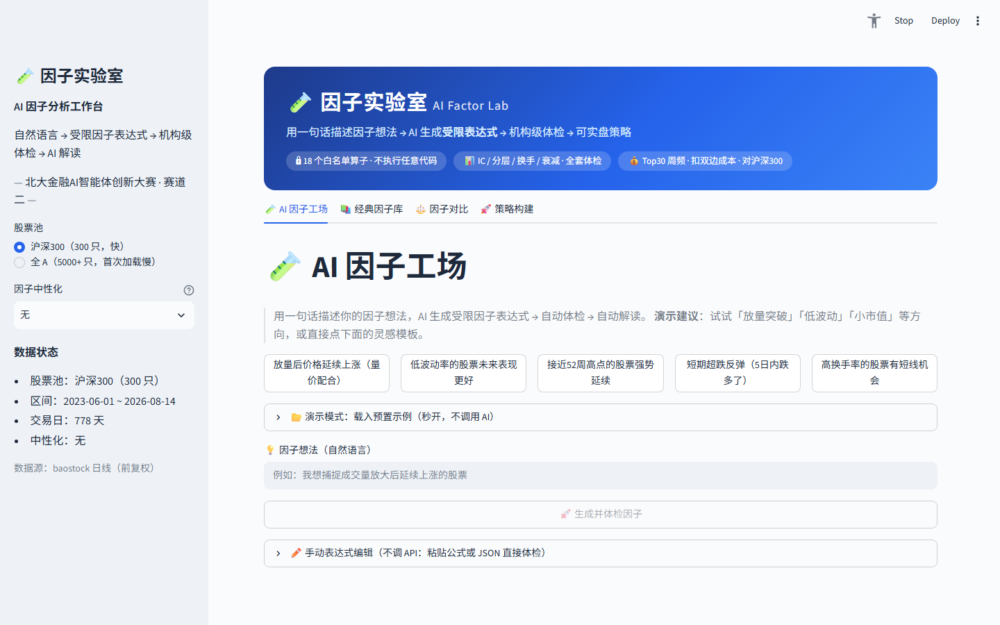<figcaption>图 3-1：首屏——hero 横幅 30 秒讲清「这是什么」，下方即因子想法输入框。</figcaption></figure>
<figure>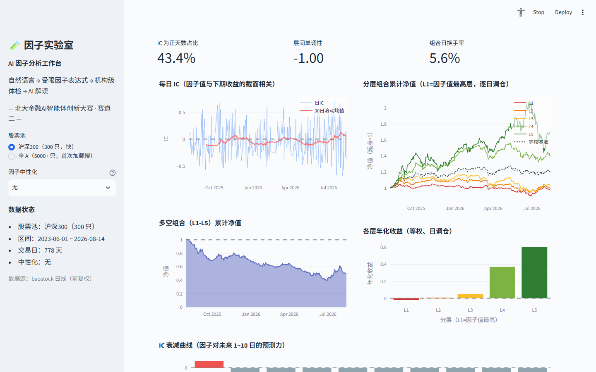<figcaption>图 3-2：载入预置示例「低波动率」后的即时状态——结论徽章 + 评分 + 八项指标卡。</figcaption></figure>
</div>

<div class="fig-grid">
<figure>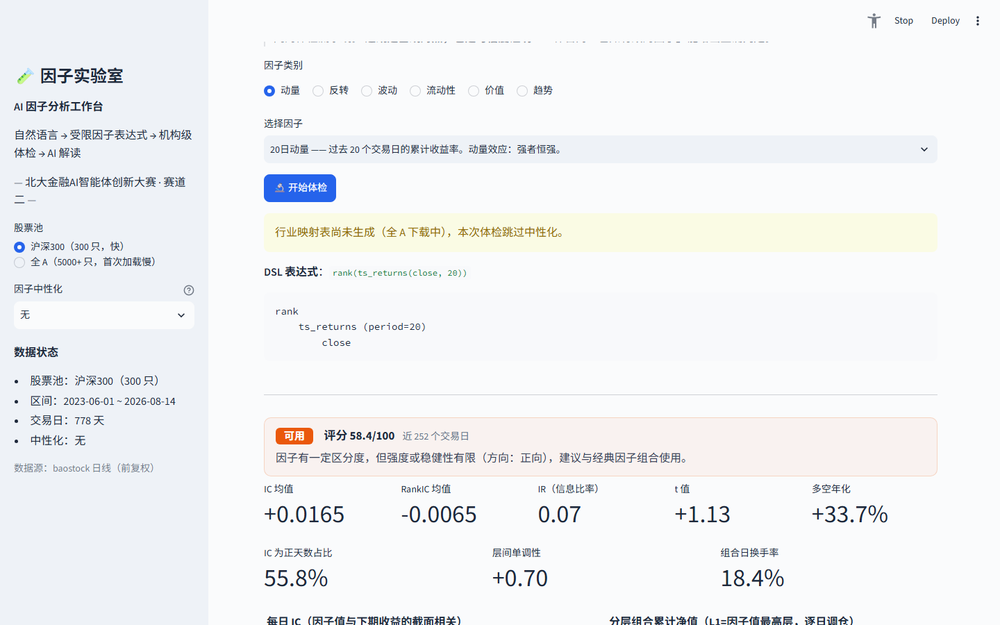<figcaption>图 3-3：经典因子库——10 个教科书因子一键体检，对照组证明工作台严谨。</figcaption></figure>
<figure>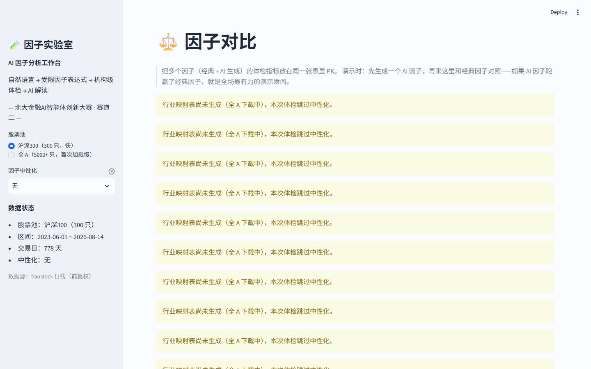<figcaption>图 3-4：因子对比——评分 PK 榜 + 全部因子策略净值同屏。</figcaption></figure>
</div>

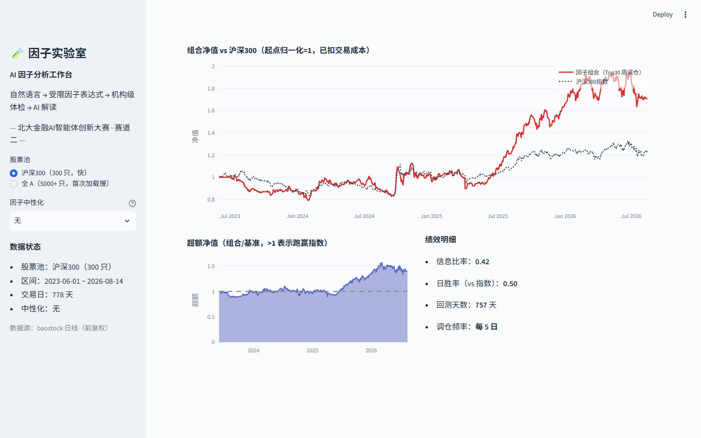

*图 3-5：策略构建——任意因子做成 Top-30 周频组合，扣双边成本，对沪深300 指数。「一句话想法 → 体检报告」完整体检分钟级内可查（沪深300 池约 15–40s，全 A 池约 30–150s，实测）。*

<div class="callout info"><h4>真实体验记录（2026-08 第一人称实测，数字与第 6 章同源）</h4>
<p>以量化初学者身份首次完整体验闭环，约 30 分钟，全程零代码、零 API 配置。以下为本次实测的真实输出，与 6 章同一管线、可一键复现：</p>
<ul>
<li><b>想法 → 受限表达式</b>：「连续放量之后，股价短期还能延续上涨吗？」→ AI 生成受限表达式（LLM 调用约 40 秒）：<code>rank(mul(div(ts_mean(volume,5), ts_mean(volume,20)), ts_returns(close,5)))</code>——量比(5日/20日) × 5 日收益，落在 18 算子白名单内；</li>
<li><b>体检（沪深300 池 · 251 日滚动窗口）</b>：评分 <b>66.4</b>（达标档）；IC 均值 0.020（t=1.50，弱正不显著）、IC 为正天数占比 53.8%；五层单调性 <b>1.0</b>（强单调）；日均换手 <b>34.7%</b>（偏高）——AI 解读如实指出「IC 偏弱、换手偏高」，不吹嘘自己生成的因子，结论与 6.3 PK 表一致：方向站在动量主线、但成本敏感；</li>
<li><b>策略构建</b>：一键生成 Top-30 周频组合净值（扣双边成本），与沪深300 指数同屏对比——3 年样本内年化 <b>+14.4%</b>、超额 <b>+6.0%</b>（图 6-3/6-4，同一管线重算）；</li>
<li><b>可复现</b>：每一步输出（表达式、八项指标、迭代轨迹）均可在工作台内点开查看；完整复现见 10.3 一键复现。</li>
</ul>
<p>「想法 → 可验证结论」的直达体验，正是两道门槛（生成门槛 + 验证门槛）被拆掉之后的样子。</p>
</div>

# 四、技术方案

## 4.1 系统架构

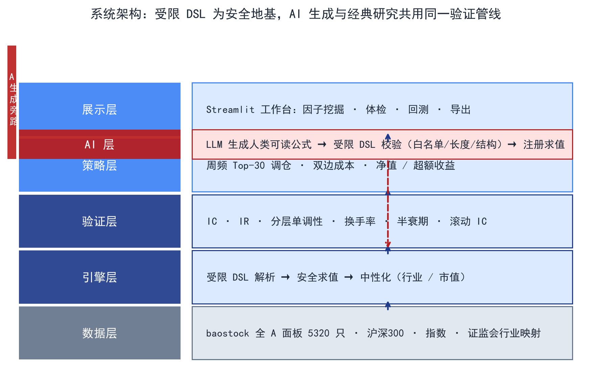

*图 4-1：系统架构——数据 → 引擎 → 验证 → 策略 → 展示五层主栈，左侧 AI 生成旁路；LLM 只输出受限表达式，与经典因子走完全相同的验证管线。*

技术栈：Python 3.14 / pandas（向量化）/ numpy / baostock / Streamlit / plotly / DeepSeek API。

## 4.2 数据管道

- **双股票池**：沪深300 成分股（300 只，机构核心池）与全 A 股（5320 只，2026-08 扩展），3 年日线（778 个交易日，2023-06-01 ~ 2026-08-14），baostock 前复权数据，字段含 close/high/low/volume/amount/turn/peTTM/pbMRQ + 沪深300 指数（策略基准）；
- **长表 → 宽面板**：以 (date, code) 多级索引 unstack 成 date × code 面板，因子 DSL 按截面/时序两轴向量化计算；
- **行业映射**：证监会行业分类（code → 行业，baostock 口径；覆盖全 A 池 93.9%，缺口为上市初期未归类新股），中性化前置依赖；
- **基本面数据源（可扩展）**：巨潮资讯网为证监会指定的上市公司信息披露平台（法定披露免费公开），定期报告与公告即盈利收益率、账面市值比等基本面因子的原始来源——数据层预留该接入点，与 baostock 行情形成「行情 + 披露」双源闭环；
- **工程加固（免费数据源的容错设计）**：baostock 为免费公共服务器，实测深夜存在长时间不可用窗口。管道实现断点续传（已下载股票跳过）、全链路线程超时保护（socket 无超时，卡死会无限阻塞——所有 baostock 调用包裹线程 join 限时）、自动重连与「断连原地等待恢复」（60 秒探测）、失败股票补录轮——**数据安全不因服务波动而丢失**。

## 4.3 受限因子 DSL（安全地基）

**设计动机**：LLM 生成因子有两个路线——(a) 生成 Python 代码再执行（不安全）；(b) 生成受限表达式再求值（安全）。本项目选择 (b)：**AI 有创造空间，但没有越权空间**。

- **18 个白名单算子**：

| 类别 | 算子 | 说明 |
|---|---|---|
| 时序 (8) | `ts_returns` / `ts_mean` / `ts_std` / `ts_zscore` / `ts_rank` / `ts_max` / `ts_min` / `delay` | 窗口滚动计算，窗口 2~260（支持 52 周高点类因子） |
| 截面 (2) | `rank` / `normalize` | 每日横截面排序/标准化 |
| 二元 (4) | `add` / `sub` / `mul` / `div` | 表达式组合 |
| 一元 (4) | `neg` / `abs` / `log` / `signed_power` | 变换 |
{: .card-table}

- **表达式树**：因子是 JSON 树（如 `{"op":"mul","args":[{"op":"rank",...},...]}`），数据叶子直接引用字段（close/volume/...），`const` 只接受数值；
- **结构安全**：深度上限 8、节点上限 64、算子白名单——非法输入在**解析层**被拦截（中文报错），LLM 输出经 JSON Schema 校验 + 超限自动重试；
- **人类可读公式解析器**：递归下降解析器把 `ts_returns(close, 20) + 1` 这类公式转为与 LLM JSON 同构的表达式树——**AI 生成的、手动输入的、经典库内置的，最终都是同一棵树，走同一套验证**。

**已有 vs 新增（原创性边界）**：因子分析管线（IC/分层/换手/衰减）是行业标准做法（alphalens 等同类库已有），不宣称原创；本项目的增量在于——① 把「LLM 生成」与「受限表达式」接合为**结构式安全**地基（对比 RD-Agent「LLM 写代码 + 回测防火墙」的约定式安全）；② 经典因子对照组 + 生命周期如实标注，让验证管线本身可被信任；③ 面向 A 股个人研究者的开箱即用工作台（双池、离线可演示）。

## 4.4 验证引擎（量化研究标准体检）

全部因子（经典/AI/手动输入）走完全相同的验证流水线：

1. **IC / RankIC**：每日截面计算**当日因子值 vs T+1 收益**的相关系数（Pearson IC + Spearman RankIC）——因子只用 T 日及以前数据、收益取 T+1，**天然错开一天，从底层杜绝任何形式的未来函数**（免费数据源常见的前复权陷阱、次日数据缺失同样受检）；输出时序、均值、标准差、IR（均值/标准差）、t 值、IC 为正天数占比；
2. **5 层分层回测**：每交易日按因子值 qcut 分 5 层，等权日调仓，输出各层累计净值、年化收益、**多空组合（L1−L5）净值**与层间单调性指标——「因子值高是否真的涨得多」；
3. **组合换手率**：分层组合的日均换手，判断交易成本是否会吃掉收益；
4. **IC 衰减曲线**：因子对未来 1~10 日收益的预测力衰减——短线还是长线信号；
5. **综合评分（0-100）**：IC 强度 30 + 信息比率 25 + 多空年化 30 + 层间单调性 15，各分量经 **tanh 压缩**（极端值封顶，防止过拟合因子刷分）；判定三档（优秀/可用/淘汰）并标注因子方向（正/反）；
6. **评分窗口**：默认近 252 个交易日（量化行业滚动评估惯例）+ **因子生命周期图**（全样本 60 日滚动 IC）——风格切换导致因子失效时**如实画出**，不粉饰。

## 4.5 中性化（剥离行业/市值混淆）

因子值里往往混着行业与市值成分——「低波动」因子天然偏向银行/公用事业（低波动行业），直接用等于在押注行业而非因子能力。中性化 = 每个交易日截面上，因子值对**行业哑变量 + log(流通市值)** 做最小二乘回归（numpy lstsq），取残差作为新因子值：

```
F_resid = F_raw − X·β        （X：证监会行业分类哑变量 + 对数流通市值）
```

行业/市值可解释的部分被剥离，残差 F_resid 即为「与行业市值无关的纯因子信号」。

**市值代理的误差边界**：流通市值用 `成交额/换手率` 近似——换手率按流通股本计算，该比值在数学上恒等于流通市值；误差仅来自数据口径（四舍五入、停牌日异常值），量级可忽略。取该代理免引入额外数据源，接口已抽象，可直接替换真实流通市值字段。

## 4.6 策略构建（因子的最后一公里）

- **组合规则**：Top-30 等权组合、每 5 个交易日调仓（周频）、双边成本 20bps；
- **基准**：真实沪深300 指数（sh.000300）；
- **指标**：年化收益/波动/Sharpe/最大回撤/平均换手/超额年化/信息比率/胜率；
- **策略层 PK**：全部因子同一规则回测，净值同屏 + 指标表——「体检是门槛，真金白银是结果」。

<div style="page-break-before: always"></div>

## 4.7 LLM 编排

- **因子生成**：自然语言想法 + 算子说明提示词 → DeepSeek API → JSON 表达式树，经 JSON Schema 校验、深度/节点数限制，非法输出自动重试（最多 3 次）；
- **反思迭代闭环（自主性来源）**：体检评分 <50（淘汰档）时自动触发反思——把失败诊断（IC 强度/换手率/分层单调性/衰减速度）回喂 LLM，LLM 基于体检证据修改表达式结构（加长窗口平滑、调整组合方式等）后重新体检，最多迭代 2 轮；每轮的表达式与评分完整保留为可追溯的迭代轨迹——「AI 挖因子」从单轮生成升级为自主迭代闭环：AI 负责「想」，体检负责「判」，人负责「审」；
- **解读报告**：体检数字 → 中文报告（因子画像/结论/指标/风险与改进建议）；
- **离线兜底**：预置示例（presets.json），API 不可用时演示故事不中断。

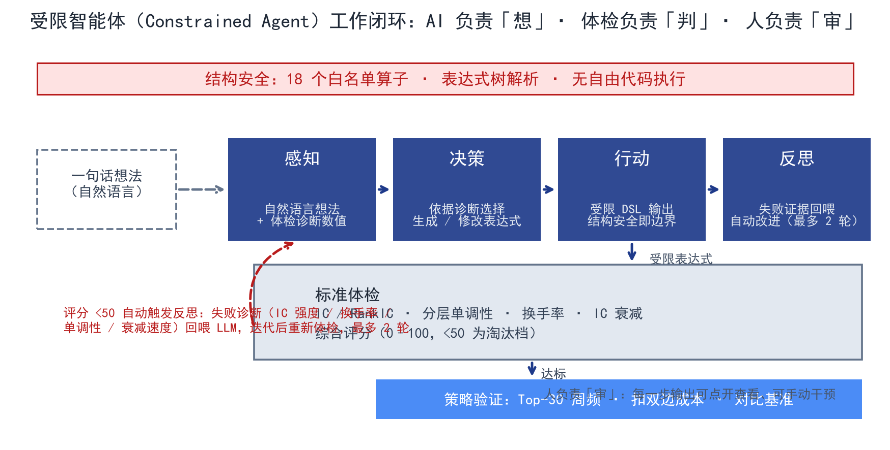

*图 4-2：受限智能体（Constrained Agent）工作闭环——感知（想法 + 体检诊断）→ 决策（生成/修改）→ 行动（受限 DSL 输出）→ 反思（失败回喂，最多 2 轮）；体检是「判官」，评分 <50 自动触发反思迭代，AI 负责「想」、体检负责「判」、人负责「审」。*

**智能体（Constrained Agent）定义与能力边界**：按「感知 → 决策 → 行动 → 反思」的智能体框架刻画本系统——**感知**：用户自然语言想法 + 体检结果的量化诊断（IC/换手/单调性/衰减分项数值）；**决策**：依据诊断选择生成新表达式或修改既有结构；**行动**：在受限 DSL 内输出表达式（结构安全即行动边界）；**反思**：评分 <50 触发，失败证据回喂，最多 2 轮。当前为**单智能体 MVP**，能力边界明确：无记忆模块（不保存历史挖掘因子，存在重复生成可能）、无多样性控制（反思可能收敛到相似表达式）、无多假设并行（串行单路径）。**后续扩展（2026-12~2027-01，见 8.3）**：记忆模块（已挖因子去重 + 复用成功子表达式）、多候选并行搜索（一次生成 K 个候选并行体检）、多样性控制（提示层约束避免收敛）——能力扩展紧扣大赛「金融 AI 智能体」主题。

**选型论证**（因子生成 = 「创意发散 + 规则约束」的混合任务）：
- **为什么用 LLM**：创意发散适合大模型——自然语言输入、一次探索几十种变体；对比人工写公式（门槛高、探索慢）；
- **为什么用受限 DSL 而非自由代码**：约束适合**结构保证**而非事后审查——自由代码有注入/失控风险（对比 RD-Agent 的约定式安全）；
- **为什么选 DeepSeek**：生成任务输出短（一个 JSON 树）、失败可重试，小模型即可胜任、成本比旗舰模型低一个量级；LLM 层为接口抽象，不绑定单一供应商。

中间路线总结：**LLM 负责「想」，结构负责「拦」，人负责「审」**。

**跨模型适配设计（LLM 层已接口化，消融实验为后续系统验证）**：生成层只依赖「提示词 + JSON Schema 校验 + 重试」契约，不绑定任何模型厂商。计划 2026-12 起（见 8.3）在 GPT-4o-mini、Claude Haiku、Qwen 等模型上做系统性消融对比，量化三个维度：① JSON 格式合规率（一次生成即通过 Schema 校验的比例）；② 首次生成通过率（首轮体检即达标的比例）；③ 反思迭代后评分提升幅度（同一起点下的迭代增益）。这既回答「DeepSeek 是否最优选择」，也验证「结构约束对弱模型的保护效果」——结果将作为 6.6 局限性的正式应对证据。

# 五、创新点与差异化

<div class="callout info"><h4>创新边界声明：复用什么，创新什么</h4>
本项目<b>复用量化研究的成熟验证方法论</b>——IC/IR、分层回测、中性化、换手率、IC 衰减是行业标准（alphalens 等开源库已有实现），经典因子库亦为标准教科书因子，均<b>不宣称原创</b>。本项目的创新集中在三层：<b>① Agent 工作范式</b>（受限智能体：LLM 负责「想」、结构负责「拦」、人负责「审」，区别于「LLM 写代码 + 事后防火墙」的约定式安全）；<b>② 安全约束架构</b>（18 算子白名单 + 表达式树 + 解析层拦截的结构式安全 DSL）；<b>③ 端到端工作台工程实现</b>（全 A 双池对照 + 经典因子可信度校验 + 反思迭代闭环 + 开源可复现）。</div>

<div class="cards">
  <div class="feature-card"><h4>01 安全受限的因子 DSL</h4><p><b>现状问题</b>：RD-Agent/Qlib 等走「LLM 写 Python 代码 + 事后防火墙」，安全靠<b>约定</b>不靠结构。<br><b>本方案</b>：18 白名单算子 + 表达式树 + 深度/节点上限，<b>解析层拦截非法输入</b>（结构安全，非事后审查）；AI 有创造空间、没有越权空间。<br><b>证据</b>：非法表达式中文报错；LLM 输出校验 + 重试。</p></div>
  <div class="feature-card"><h4>02 一切因子同一套体检管线</h4><p><b>现状问题</b>：经典因子与 AI 因子各自为政，AI 因子的可信度无锚点。<br><b>本方案</b>：经典/AI/手动输入走同一流水线；经典因子是「已知答案的对照组」。<br><b>证据</b>：工作台正确判定教科书因子（低波动 IC −0.036）；<b>AI 独立挖出的低波动因子与经典库表达式完全一致</b>。</p></div>
  <div class="feature-card"><h4>03 全链路可解释</h4><p><b>现状问题</b>：AI 量化黑盒，「回测好看但不知道为什么」。<br><b>本方案</b>：表达式树可视化 + 因子逻辑自述 + 体检报告 + 生命周期图，每一步有「为什么」。<br><b>证据</b>：生命周期图如实标注 2025-26 风格切换导致的失效。</p></div>
  <div class="feature-card"><h4>04 从因子到策略的闭环</h4><p><b>现状问题</b>：demo 止步于「生成了因子」，不回答「能赚多少」。<br><b>本方案</b>：扣成本、调仓、对真实指数对比；<b>策略层 PK</b> 全部因子同规则同屏对比。<br><b>证据</b>：11 因子 PK：AI 因子 3 年 +14.4%，跑赢 5/10 经典因子。</p></div>
  <div class="feature-card"><h4>05 智能体反思迭代闭环</h4><p><b>现状问题</b>：AI 挖因子多是「单轮生成、不行就换想法」，无自主改进。<br><b>本方案</b>：体检评分 <50 自动触发反思：失败诊断回喂 LLM，修改表达式结构后重新体检，最多 2 轮；迭代轨迹完整保留。<br><b>证据</b>：淘汰档因子自动触发迭代，候选表达式逐轮变化（窗口平滑/组合结构调整），轨迹可追溯。</p></div>
</div>

# 六、实证结果

> 数据：沪深300 成分股 300 只 × 778 交易日（2023-06-01 ~ 2026-08-14），真实 baostock 数据，前复权；策略为 Top-30 周频、双边成本 20bps、对沪深300 指数；评分窗口近 252 个交易日。

<div class="kpi-grid">
  <div class="kpi"><div class="kpi-num">+14.4%</div><div class="kpi-label">AI 因子（放量延续）3 年策略年化</div></div>
  <div class="kpi"><div class="kpi-num">+6.0%</div><div class="kpi-label">年化超额（vs 沪深300 +8.2%）</div></div>
  <div class="kpi"><div class="kpi-num">−22.8%</div><div class="kpi-label">低波动因子沪深300 池多空年化（如实标注）</div></div>
  <div class="kpi"><div class="kpi-num">+7.6%</div><div class="kpi-label">同一低波动因子在全 A 池多空年化（池子改变结论）</div></div>
  <div class="kpi"><div class="kpi-num">100%</div><div class="kpi-label">本章数字全部可复现（开源 + 免费数据源）</div></div>
</div>

## 6.1 经典因子对照（可信度验证）

| 因子 | 近1年 IC | 近1年评分 | 全样本 IC | 说明 |
|---|---|---|---|---|
| 低波动(20日) | −0.0363 | 60.8（可用） | −0.0026 | A 股最强异象之一；2023-24 有效(+0.02)、2025-26 成长行情反转(−0.02)，系统如实标注方向与生命周期 |
| 低换手(20日) | −0.0340 | 59.3（可用） | −0.0035 | 经典流动性异象，同样的风格轮动特征 |
| 60日动量(剔1日) | +0.0150 | 50.8（可用） | +0.0087 | **四年全样本 IC 均为正**——A 股中期动量稳健性的直接实证 |
| 20日动量 | +0.0142 | 56.1（可用） | +0.0059 | 动量弱正，符合 A 股特征 |
| 账面市值比(1/PB) | −0.0204 | 55.0（可用） | +0.0037 | 2023-24 价值风→2025-26 成长风切换，生命周期图一目了然 |
{: .card-table}

低波动的生命周期见下图——60 日滚动 IC 如实画出「有效 → 失效 → 回摆」的全过程：

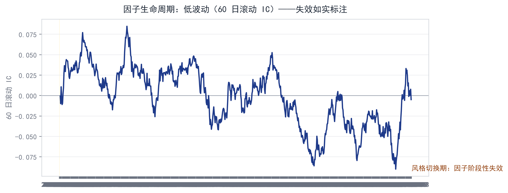

*图 6-1：低波动因子 60 日滚动 IC（样本 2023-06-01 ~ 2026-08-14，baostock 前复权；浅黄 = 2025-26 风格切换期）。IC 走弱、失效段如实可见——系统不粉饰，标注即可信度。*

## 6.2 AI 因子（真实生成记录）

**示例 1：放量后价格延续上涨（量价配合）**

- AI 表达式：`rank(量比5日/20日 × 5日动量)`——放量确认 + 动量延续；
- 体检（近1年）：IC +0.0196 / 评分 66.4 / 可用；
- **3 年策略：组合年化 +14.4% vs 沪深300 +8.2%，超额 +6.0%，Sharpe 0.53**。

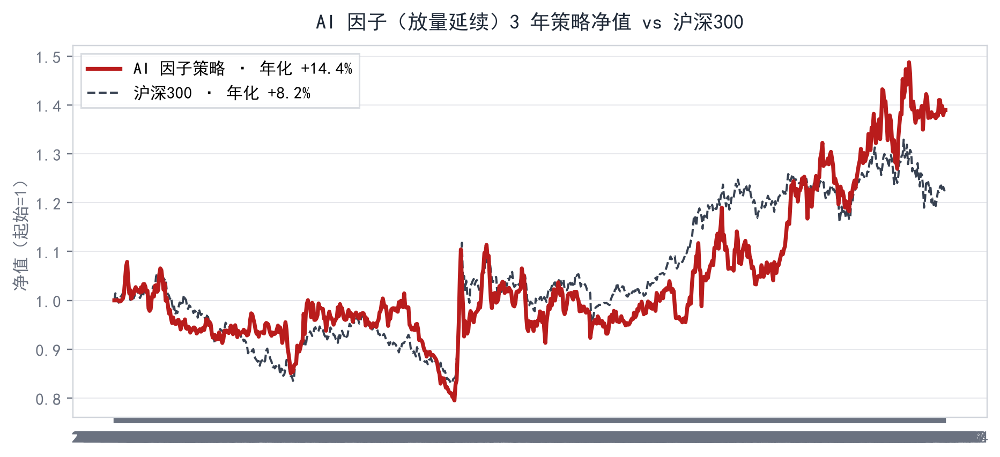

*图 6-2：AI 因子（放量延续）3 年策略净值 vs 沪深300（样本 2023-06-01 ~ 2026-08-14，baostock 前复权），与上表数字同源（2026-08 实测）。*

**示例 2：低波动率的股票未来表现更好**

- AI 独立挖出的表达式 `rank(neg(ts_std(ts_returns(close,1),20)))` **与经典因子库内置表达式完全一致**——AI 因子与教科书殊途同归，可信度互证；
- 体检（近1年）：IC −0.0363 / 评分 60.8 / 可用（方向标注为反向）；
- 3 年策略：年化 +9.0% vs 指数 +8.2%，回撤 −17.6% 显著低于指数。

**过滤能力（不粉饰失败）**：并非每次生成都直接达标——低分候选会被体检引擎如实淘汰，或进入反思迭代继续改进；反思测试中即出现调整不当、评分回落的轮次，系统如实保留每一轮轨迹。「生成 → 过滤 → 保留」的完整漏斗，才是真实研究工作流——工具的价值恰恰在把坏因子拦在策略层之外。

## 6.3 策略层 PK（全部因子同规则对比，2026-08 实测）

| 因子 | 类型 | 3年年化 | 超额 | Sharpe | 最大回撤 |
|---|---|---|---|---|---|
| 20日动量 | 经典 | **+41.0%** | **+33.0%** | 1.31 | −20.9% |
| 距52周高点 | 经典 | +32.2% | +23.2% | 1.44 | −14.7% |
| 60日动量(剔1日) | 经典 | +31.6% | +21.9% | 0.91 | −37.0% |
| 量比(5日/20日) | 经典 | +17.8% | +9.4% | 0.74 | −16.7% |
| 非流动性(Amihud) | 经典 | +16.9% | +8.5% | 0.74 | −22.4% |
| 盈利收益率(1/PE) | 经典 | +14.8% | +6.3% | 0.93 | −14.8% |
| **AI 放量延续** | **AI** | **+14.4%** | **+6.0%** | 0.53 | −26.3% |
| 低换手(20日) | 经典 | +10.5% | +2.1% | 0.72 | −15.7% |
| 账面市值比(1/PB) | 经典 | +9.1% | +0.7% | 0.57 | −22.8% |
| 低波动(20日) | 经典 | +9.0% | +0.6% | 0.65 | −17.6% |
| 5日反转 | 经典 | +5.3% | −3.1% | 0.19 | −38.8% |
{: .card-table}

年化排序一图看清（AI 因子朱红高亮，处中上游第 7/11——不是极端值，也不是过拟合特化的尖峰）：

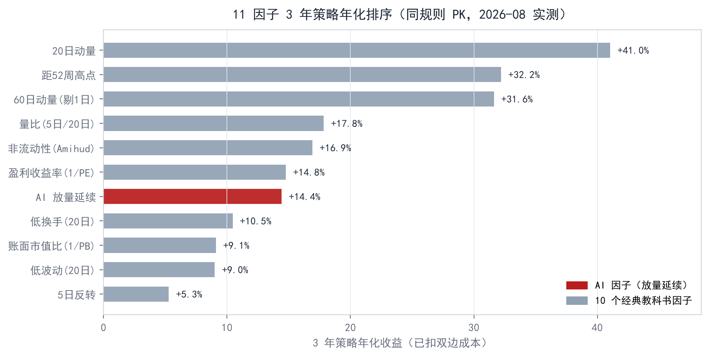

*图 6-3：11 因子 3 年策略年化排序（与上表同源同管线，2026-08 实测）。AI 放量延续 +14.4% 处中上游，且方向与动量家族一致（量比、60日动量、距52周高点均为动量侧）——AI 独立挖出的因子落在市场主线上，而非孤立特化。*

11 条净值曲线同屏对比（灰蓝 = 10 个经典因子，朱红 = AI 放量延续）：

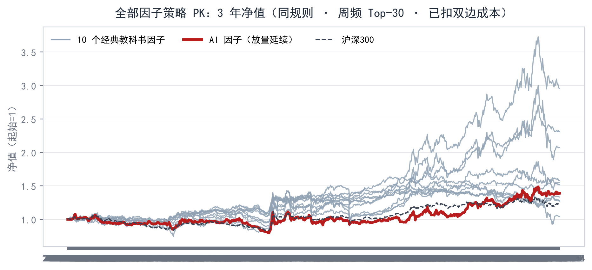

*图 6-4：11 因子同规则策略 PK 净值（样本 2023-06-01 ~ 2026-08-14，baostock 前复权，2026-08 实测）。3 年间 AI 因子净值站稳中上游，且独立指向动量一侧。*

<div class="callout info"><h4>PK 结论（与生命周期图互相印证）</h4>
<ul>
<li><b>动量/趋势是 2025-26 AI 牛市的主线</b>——20日动量年化 +41%、52周高点 +32%，Sharpe &gt;1.3；</li>
<li><b>AI 因子跑赢 5/10 经典因子</b>（低波动、低换手、反转、账面市值比、量比），且挖出的因子恰属动量一侧——<b>AI 不知道今年是牛市，但它挖出来的因子，方向站在市场主线这一侧</b>；</li>
<li>全表同一规则扣成本回测，差异只来自因子本身。</li>
</ul>
</div>

## 6.4 股票池的边界（双池对照实证，2026-08 实测）

因子有效性依赖股票池——同一个因子在沪深300 与全 A 上可能结论相反，这正是机构把「池子选择」作为研究前置的原因。工作台内置双池对照（同一体检管线、同一回测规则）：

| 因子 | 沪深300 多空年化 | 全 A 多空年化 | 结论 |
|---|---|---|---|
| 20日动量 | **+14.4%** | −9.7% | 动量在大盘池有效（2025-26 主线），全 A 追高被反转 |
| 低波动 | −22.8% | **+7.6%** | 低波动在全 A 反而有效（小盘防御属性） |
| 放量延续 | +10.5% | +7.6% | 全 A 上仍为正贡献，但分层质量明显下降（评分 38.9 → 19.6） |
{: .card-table}

（多空年化 = 因子值最高层与最低层的收益差，5 层等权、日调仓；全样本 2023-06 ~ 2026-08，778 交易日，与图 6-1/6-2 同口径。2026-08 全 A 验证实测，见 `data/ashare_verify_none.json`，同管线可复现）

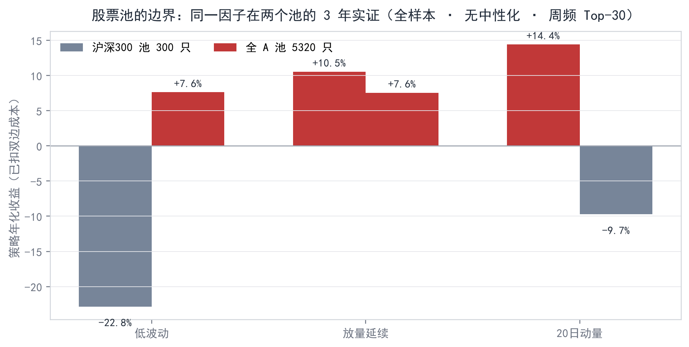

*图 6-5：同一因子在两个池的 3 年实证（全样本 · 无中性化 · 周频 Top-30 已扣成本）——20日动量在沪深300 +14.4%、在全 A −9.7%，方向直接反转。*

<div class="callout warn"><h4>池子边界结论</h4>
因子有效性高度依赖股票池——沪深300 上有效的动量因子，在全 A 追高反而被反转；低波动因子则相反；量价因子在全 A 虽未失效但显著打折。<b>不能把单一池子的结论直接迁移。</b>同时口径本身也影响结论：同一因子在近 252 交易日窗口与全样本 3 年窗口的评分可以相差 3 倍以上（放量延续全 A：60.1 → 19.6，alpha 集中在 2025-26）；行业/市值中性化同样会改变强弱甚至方向（低波动全 A 中性化后评分 15.6 → 35.2）——这正是系统默认展示「近 252 日窗口 + 全样本滚动 IC 生命周期」双视角的原因：<b>结论必须连同池子、窗口、口径一起解读</b>。</div>

## 6.5 稳健性与敏感性

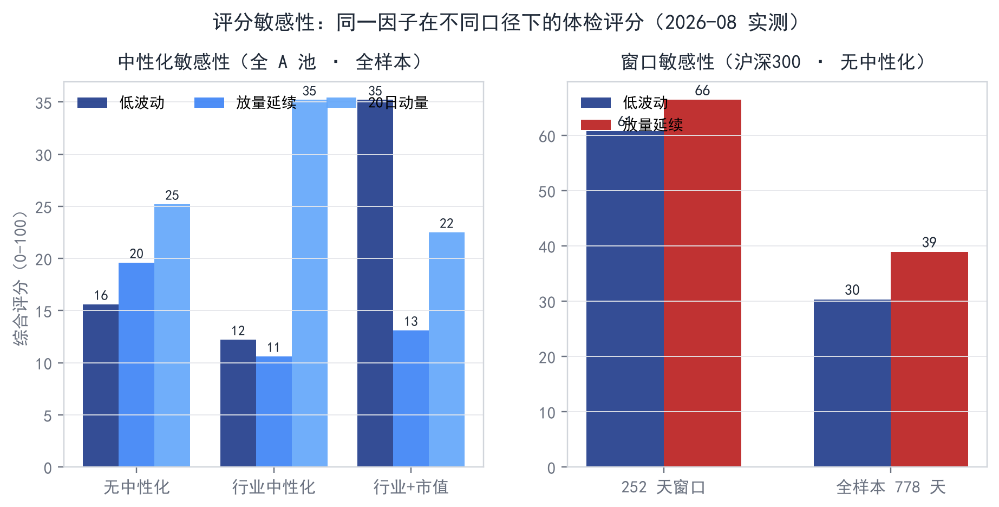

*图 6-6：同一因子在不同口径下的体检评分（2026-08 实测）——左：中性化配置（低波动全 A 全样本 15.6 → 35.2，行业+市值中性化显著改变结论）；右：窗口长度（沪深300 评分排序稳定——放量延续始终领先，但绝对值波动大，252 天 60.8/66.4 → 全样本 30.3/38.9）。*

- 3 年样本覆盖 2024 调整市与 2025-26 AI 牛市；全样本滚动 IC 让「风格切换导致失效」可见——**系统不粉饰失效**，这是可信度而非扣分项；
- 评分 tanh 压缩极端值防过拟合刷分；换手/衰减/成本全链路约束；经典因子对照组验证管线正确性；
- 行业/市值中性化已实现（每日截面回归剥离行业与市值成分，含证监会行业分类映射）。

## 6.6 局限性与边界（主动暴露，不回避）

<div class="callout warn"><h4>实证结论的有效范围</h4>
以下局限是本章所有结论成立的前提条件——<b>结论必须连同池子、窗口、口径与本节边界一起解读</b>。每一项均给出应对路径。</div>

1. **样本区间较短（3 年）**：2023-06 ~ 2026-08 仅覆盖 2024 调整市 + 2025-26 上行行情，**缺少熊市样本**；量化研究的完整检验需要跨越牛熊的经济周期样本。评分对窗口敏感（近 252 日 vs 全样本差异显著，见 6.5）即此局限的直接体现。**应对**：样本外（Out-of-Sample）动态跟踪**已提前启动**——2026-08-17 起每日生成信号、以 T+1 收益生效计算理论净值（收盘口径，与样本内回测一致，不涉及真实资金）；首周（截至 8/21，6 个收益日）策略 −5.68% vs 基准 −1.01%，**样本不足不做结论**，随数据积累自然扩展覆盖的市场状态（跟踪记录见 8.3）。

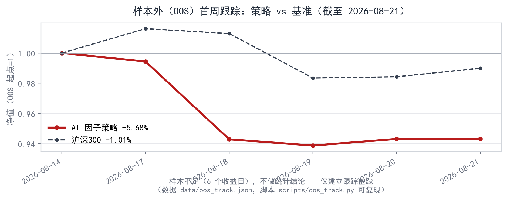

*图 6-7：样本外首周跟踪（截至 2026-08-21，6 个收益日；样本内权重、因子表达式、调仓规则全部不变）——策略 −5.68% vs 基准 −1.01%，超额 −4.68%；样本不足不做统计结论，仅建立跟踪基线（数据 `data/oos_track.json`，脚本 `scripts/oos_track.py` 可复现）。*

2. **交易成本简化**：策略回测仅计双边 20bps 固定成本，**未模拟滑点、冲击成本与资金容量**——对小资金组合影响可控，实盘前必须按资金规模与流动性建模。**应对**：样本外跟踪阶段补齐成本/容量模型（见 8.2 阶段三）。
3. **全 A 池未剔除新股**：上市初期（<60 交易日）样本未剔除，新股波动极端会抬高截面噪声。**应对**：需补上市日期字段，属数据层扩展而非验证逻辑变更（已列入 v1.1）。
4. **流通市值代理字段**：中性化使用 `成交额/换手率` 近似流通市值（数学上恒等，误差来自数据口径噪声）而非原始真实字段——接口已抽象，可直接替换真实流通市值。
5. **LLM 单一模型，无消融实验**：因子生成仅使用 DeepSeek API，不同大模型的生成成功率、因子质量差异未系统对比——LLM 层已接口化，跨模型消融为后续工作。
6. **因子类型以量价为主**：基本面因子（财报/公告事件驱动）仅预留接口、未完整实现。**应对**：事件驱动因子为 2027 计划（见 8.3 里程碑）。

## 6.7 可复现性

本章全部数字可在一台普通电脑上、用**免费数据源**复现：行情数据来自 baostock 公开接口（`scripts/build_data_*.py` 自动下载，含断点续传与去重）；因子表达式、验证管线（IC/分层/换手/衰减/评分）与回测规则（Top-30、周频、双边 20bps）全部在代码库中公开；**v0.9 已于 2026-08 开源（github.com/Yumm-del/factor-lab，MIT License），任何人现在即可下载并复现同一份报告**——可复现是设计默认，不是承诺。

<div class="callout risk"><h4>风险声明</h4>
本工具仅为量化研究实验工作台，所有回测结果为历史数据模拟，不构成任何投资建议；历史回测收益不能保证未来表现，实盘还需额外考虑滑点、冲击成本与资金容量。</div>

# 七、工程挑战与可复现性

## 7.1 工程挑战与解法

<div class="cards">
  <div class="feature-card"><h4>数据源可靠性</h4><p><b>问题</b>：baostock 免费公共服务器，深夜实测存在数小时不可用窗口；socket 无超时，断连后客户端无限阻塞（曾卡死一夜）。<br><b>解法</b>：全链路线程超时保护 + 断点续传 + 自动重连 + 断连原地等待恢复 + 失败补录轮——数据不因服务波动丢失。</p></div>
  <div class="feature-card"><h4>安全约束</h4><p><b>问题</b>：LLM 输出非法表达式（注入/越权/资源耗尽）。<br><b>解法</b>：白名单算子 + 深度/节点上限 + JSON Schema 校验 + 重试，<b>非法输入在解析层被拦截</b>。</p></div>
  <div class="feature-card"><h4>可信度</h4><p><b>问题</b>：AI 因子「回测好看实盘失效」的普遍质疑。<br><b>解法</b>：经典因子对照组 + 同一验证管线 + 生命周期图如实标注失效 + 评分防过拟合（tanh 压缩）。</p></div>
  <div class="feature-card"><h4>计算性能</h4><p><b>问题</b>：全 A 5000+ 只 × 因子计算耗时。<br><b>解法</b>：宽面板向量化（unstack + numpy）：全 A 池单因子完整体检约 28–35s（无中性化）、50–80s（行业中性化）、60–150s（行业+市值中性化），沪深300 池 14–38s（2026-08 实测，`scripts/ashare_verify.py` 可复现）；UI 交互与图表渲染为秒级。</p></div>
</div>

## 7.2 数据来源与质量审计（2026-08 自动审计，`scripts/data_audit.py` 可复现）

| 审计项 | 结果 |
|---|---|
| 数据规模 | 全 A 面板 4,064,284 行，5320 只 × 778 交易日；沪深300 300 只 × 778 日 |
| 完整性 | 重复 (code,date) 对 **0**；close>0 全部通过；high≥low 全部通过 |
| 极端值 | 单日收益 |ret|>30% 仅 57 条（0.0014%，均为前复权除权跳变点） |
| 基本面字段 | peTTM 负值 25.3%（亏损企业，应存在）；pbMRQ 负值 0.69%（资不抵债，少量正常） |
| 量价一致性 | turn 缺失 0.59%；volume/amount 矛盾 0 条 |
| 指数对照 | 沪深300 指数 778 天与成分股面板对齐，|日收益|≤10% 全部通过 |
| 行业映射 | 证监会行业分类覆盖全 A 池 93.9%（83 个行业；缺口为上市初期未归类新股） |
{: .card-table}

**审计结论**：数据完整性与一致性全部通过，未发现重复、异常价格或量价矛盾；peTTM 负值比例与亏损企业占比一致，属正常分布。

## 7.3 一键复现

| 步骤 | 命令 |
|---|---|
| 1. 安装依赖 | `pip install -r requirements.txt` |
| 2. 下载数据（断点续传） | `python scripts/build_data_ashare.py` / `python scripts/build_data.py` |
| 3. 全 A 验证（本章 6.4/6.5 数字） | `python scripts/ashare_verify.py`（约 30 分钟全量） |
| 4. 数据质量审计（7.2 表） | `python scripts/data_audit.py` |
| 5. 启动工作台 | `streamlit run app.py` |
{: .card-table}

# 八、落地计划与商业化

## 8.1 目标用户与场景

- **个人研究者/量化初学者**：低门槛挖掘因子、学习量化研究标准验证方法（本项目当前服务场景）；
- **资管/私募研究团队**：因子挖掘的辅助基础设施（AI 生成候选 + 自动验证 + 人工研判）；
- **投资者教育**：把「因子是什么、怎么验证」变成可交互的工具。

**市场与付费意愿（2026-08 核实）**：同类工具的付费意愿已被市场验证——聚宽免费版开放注册、完整能力按年订阅（VIP 999 元/年、SVIP 2799 元/年，2025 年调价）并运营多年；机构端 Wind/聚宽机构版年费订阅为团队付费惯例。本项目以开源免费版覆盖学生/初学者长尾，以增值服务覆盖付费意愿强的进阶用户。

**市场规模（TAM，估算口径，2026-08）**：个人端——A 股投资者超 2.2 亿，假设其中 0.1% 有量化研究兴趣（约 22 万人），按聚宽 VIP 999 元/年的价格锚点计，潜在市场约 **2.2 亿元/年**；机构端——百亿量化私募 55 家，每家 3–5 人研究团队使用因子挖掘辅助工具、人均年费 5000–10000 元，约 100–300 万元/年（初期）。合计可触达市场约 **2.3 亿元/年**（估算值，用于量级判断；数据来源同 2.2 节：中基协备案数据 / 私募排排网统计）。

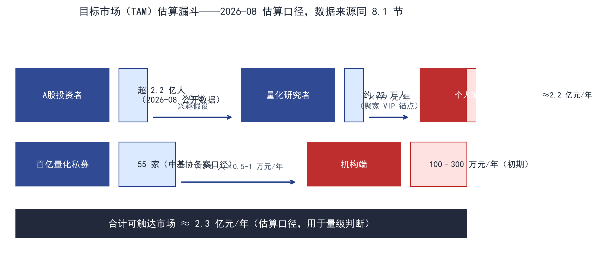

*图 8-1：目标市场（TAM）估算漏斗（2026-08 估算口径，用于量级判断；数据来源同 8.1：中基协备案数据 / 私募排排网统计）。*

## 8.2 落地路径

<div class="timeline">
  <div class="tl-item"><b>阶段一 · 2026-08~09</b><span>工作台 MVP——受限 DSL、验证引擎、双池数据、策略 PK、演示材料齐备；全 A 股池完成 + 行业中性化验证闭环；<b>9/10 提交大赛作品</b>（项目书 + 工作台 + 演示材料）。</span></div>
  <div class="tl-item"><b>阶段二 · 2026-09~10</b><span>v0.9 已于 2026-08 开源（GitHub: Yumm-del/factor-lab）；<b>9/10 提报前完成</b>真实用户反馈收敛与全 A 池因子库扩充，<b>v1.0</b>（2026-09）随提报同步发布。</span></div>
  <div class="tl-item"><b>阶段三 · 2026-12~2027-01</b><span>因子合成（IC 加权）+ 事件驱动因子（财报/公告）试点 + <b>样本外（Out-of-Sample）动态跟踪持续进行</b>（已于 2026-08-17 提前启动，首周记录见 8.3）——每日生成因子信号、不实际下单，以 T+1 收益计算理论净值，实证成本/滑点/容量模型（个人参赛不涉及真实资金，科学且合规）。</span></div>
  <div class="tl-item"><b>阶段四 · 2027 起</b><span>对接研究团队试点——以「因子挖掘辅助」切入量化研究流程，输出可验证的研究结论。</span></div>
</div>

## 8.3 里程碑时间表

<div class="timeline">
  <div class="tl-item"><b>2026-08</b><span><b>v0.9 已开源</b>（GitHub: Yumm-del/factor-lab，MIT License）</span></div>
  <div class="tl-item"><b>2026-08-17</b><span><b>样本外（OOS）动态跟踪启动</b>——首周实测（截至 8/21，6 个收益日）：策略 −5.68% vs 基准 −1.01%，超额 −4.68%；样本不足不做结论，每周增量跟踪（数据 `data/oos_track.json`，脚本 `scripts/oos_track.py` 可复现）</span></div>
  <div class="tl-item"><b>2026-09-10</b><span><b>大赛作品提报</b>（项目书 + 工作台 + 演示材料）；全 A 股池完成 + 行业中性化验证闭环</span></div>
  <div class="tl-item"><b>2026-09</b><span>v1.0 随 9/10 提报同步发布（用户反馈收敛 + 全 A 池因子库扩充）</span></div>
  <div class="tl-item"><b>2026-12~2027-01</b><span>因子合成与事件驱动因子；样本外（Out-of-Sample）动态跟踪持续积累</span></div>
  <div class="tl-item"><b>2027-Q1</b><span>研究团队试点与反馈迭代</span></div>
</div>

## 8.4 商业化路径

<div class="cards">
  <div class="feature-card"><h4>开源内核 + 增值服务</h4><p>对标聚宽「免费版 + VIP」模式：v1.0 开源免费——个人研究者即开即用，形成用户基数与口碑；增值层收费：云端全 A 因子库更新订阅、中性化增强模块、批量因子扫描服务。</p></div>
  <div class="feature-card"><h4>机构端</h4><p>阶段四（2027）研究团队试点即商业化第一步——「因子挖掘辅助」作为研究流程的插件式服务，按团队订阅制收费（Wind/聚宽机构版为既有定价锚点）。</p></div>
  <div class="feature-card"><h4>成本结构</h4><p>核心引擎本地运行，依托公开免费金融数据源（baostock / 巨潮公开披露），整体运维成本可控。</p></div>
  <div class="feature-card"><h4>合规与边界</h4><p>本工具为研究工作台而非交易系统，所有输出须经人工研判后方可进入实盘决策——AI 负责「想」，人负责「审」。</p></div>
</div>

**定价锚点**：聚宽 VIP 999 元/年、SVIP 2799 元/年（2025 年调价）；Wind 单终端 39,800 元/年——市场对「研究工具年费」的接受区间已被验证，付费意愿无须再教育。本项目以开源免费版建立用户基数后自然转化，先免费、后付费；增值层（云端全 A 因子库更新、批量因子扫描等）的定价由落地阶段按市场反馈验证，不在本方案书预设。

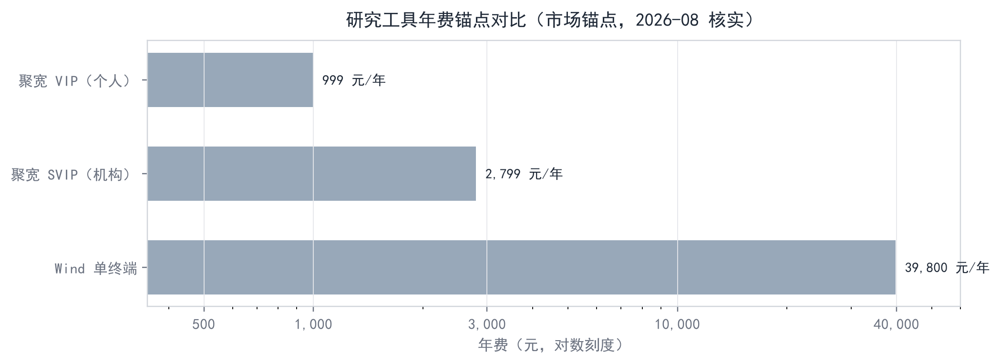

*图 8-2：研究工具年费锚点对比（2026-08 核实：聚宽 2025 年调价、Wind 官网公开报价）——「研究工具按年收费」的付费意愿已被市场验证；本项目具体定价由落地阶段按市场反馈验证，不在本方案书预设。*

**获客路径与增长假设**：① 开源社区——v0.9 已开源（GitHub: Yumm-del/factor-lab），配合掘金/知乎量化专栏技术分享，预计 3–6 个月形成自然流量；② 大赛曝光——晋级即获得赛事生态展示位（BigQuant 作品广场等）；③ 赛事学术资源——作为 AFAC 赛事产出项目，天然获得主办方学术资源关注；④ 量化社群——聚宽社区、米筐论坛 KOL 测评与口碑传播。增长假设：开源免费版 6 个月内积累 1000+ 用户 → 5%–10% 转化为增值付费 → 年收入约 5–10 万元（覆盖维护成本）→ 12–18 个月后启动机构端试点。

**增长路径（PLG：产品驱动增长）**：初学者在工具内成长为专业研究者——**每个免费用户都是机构端的未来采购决策者**：他把研究方法论与因子表达式带进机构，机构按团队订阅采购（个人免费使用、组织付费购买，QuantConnect / Slack 同模式）。「面向初学者」因此不是市场上限，而是增长引擎：免费层沉淀用户基数与口碑，付费层在进阶能力与机构端兑现。

<div style="page-break-before: always"></div>

## 8.5 落地风险与应对

<div class="cards">
  <div class="feature-card"><h4>机构已有成熟内部因子平台，为何采用</h4><p><b>风险</b>：量化机构普遍自建因子库与验证框架，新工具难切入。<br><b>应对</b>：不做替代品，做「因子挖掘辅助插件」——对接既有流程（表达式导出/导入接口、与自研管线同构的验证输出），先以研究团队试点验证增量价值（AI 生成候选 + 自动验证 + 人工研判），再谈订阅。</p></div>
  <div class="feature-card"><h4>免费数据源的天花板</h4><p><b>风险</b>：baostock 覆盖与稳定性有限（免费服务器深夜不可用、字段以日线量价为主），机构场景数据不够用。<br><b>应对</b>：数据层接口抽象（与中性化市值代理同一原则）——商业落地切换付费行情源（Wind/聚宽机构接口），成本计入服务定价；免费源保留为学生与个人研究者的默认路径。</p></div>
  <div class="feature-card"><h4>开源项目的可持续维护</h4><p><b>风险</b>：个人维护的开源项目存在停更风险，用户信任受损。<br><b>应对</b>：核心引擎模块化收敛（验证逻辑稳定后变更面小，新能力以插件方式接入）；贡献指南 + issue 模板沉淀社区路径；增值服务收入反哺核心维护，形成「开源口碑 → 增值付费 → 反哺开源」的闭环。</p></div>
  <div class="feature-card"><h4>合规边界</h4><p>本工具为研究工作台而非交易系统，所有输出须经人工研判后方可进入实盘决策；样本外跟踪阶段仅生成理论净值信号、不涉及真实资金（个人参赛场景科学且合规）。</p></div>
</div>

# 九、个人介绍

<div class="feature-card" style="grid-column: 1 / -1;">
<h4>吕滢滢 · 广东金融学院 金融科技专业本科生</h4>
<p><b>技术能力</b>：Python 全栈（pandas/numpy 向量化、Streamlit 应用开发）、金融数据处理（baostock 数据管道、断点续传容错设计）、量化研究方法学（IC/IR、分层回测、换手率、IC 衰减——alphalens 同源方法学）、AI 工程实践（LLM 接口编排、JSON Schema 校验、递归下降表达式解析器）。</p>
<p><b>项目角色</b>：项目发起人与产品/数据/验证逻辑设计者；工程实现由 AI 辅助开发（本人主导架构设计与验证）。</p>
<p><b>参赛动机</b>：验证「AI 辅助量化研究」的可行路径——让 AI 在安全约束内参与金融研究，而不只是「生成一堆好看但不负责的代码」，把「从想法到验证」的距离压到 30 秒。</p>
<p><b>亲测用户</b>：本人即产品的第一个目标用户——以量化初学者身份完整走通第 3 章实录的 30 分钟闭环（一句话想法 → 组合净值曲线，全程零代码）；「零门槛」不是产品设想，是作者亲测后的结论。</p>
<p><b>个人展望</b>：持续深耕「AI × 量化」交叉领域——因子挖掘自动化、模型化调度（自动迭代生成→体检→保留有效因子）、事件驱动研究，让受限表达式的安全思路延伸到更多金融场景。</p>
</div>

# 十、附录

## 10.1 使用说明

1. 安装依赖 → 配置 DeepSeek API key → 下载数据 → `streamlit run app.py`；
2. 「AI 因子工场」输入想法（如「放量后价格延续上涨」）→ 约 20 秒生成表达式 + 体检 + 报告；
3. 「手动表达式编辑」可直接粘贴公式（如 `rank(ts_mean(close,5)/ts_mean(volume,20))`）独立体检；
4. 「策略构建」把因子做成组合；「因子对比」看全部因子策略 PK；
5. 演示断网预案：预置示例（presets.json）离线可演示，故事不中断。

## 10.2 数据口径总表

| 项 | 口径 |
|---|---|
| 行情数据 | baostock 日线，前复权，2023-06-01 ~ 2026-08-14（778 交易日） |
| 股票池 | 沪深300 成分 300 只；全 A 5320 只（含主板/创业板/科创板） |
| 行业分类 | 证监会行业分类（baostock 口径，覆盖全 A 93.9%） |
| 收益定义 | T 日因子值 vs T+1 收益（天然错开一天，杜绝未来函数） |
| 评分窗口 | 近 252 交易日（滚动）；生命周期图为全样本 60 日滚动 IC |
| 综合评分 | IC 强度 30 + IR 25 + 多空年化 30 + 单调性 15，tanh 压缩，0-100 |
| 策略规则 | Top-30 等权，周频（5 日）调仓，双边成本 20bps，基准 sh.000300 |
| 中性化 | 每日截面回归：行业哑变量 + log(成交额/换手率)；接口可替换真实流通市值 |
| 验证输出 | `data/ashare_verify_none.json`（全样本 14 条实验）、`ashare_verify.json`（252 天 10 条） |
{: .card-table}

## 10.3 一键复现实录（2026-08-24 真实重跑）

<figure>
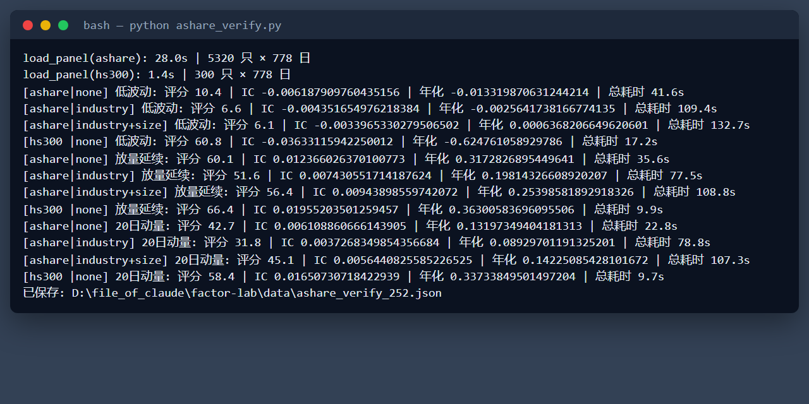
<figcaption>图 10-1：scripts/ashare_verify.py 真实运行输出（2026-08-24 本机重跑，屏幕实录，输出逐行未修改）。</figcaption>
</figure>

**数据来源与复现路径**（口径与 10.2 数据口径总表一致）：

| 项 | 说明 |
|---|---|
| 数据来源 | baostock 日线（前复权）；2023-06-01 ~ 2026-08-14 全量 + 2026-08-24 增量（8/15 起 5 个交易日）；本地缓存 `data/hs300_raw.csv` / `data/hs300_index.csv`，重跑不重新下载 |
| 复现命令 | `python scripts/ashare_verify.py`（约 10 分钟）；全样本 3 年版加 `VERIFY_WINDOW=none` |
| 结果文件 | `data/ashare_verify_252.json`（近 252 日窗口，本次产出）；`data/ashare_verify_none.json`（全样本，2026-08-23 实测） |
| 样本内对账 | AI 因子（放量延续）3 年策略算术年化 +14.42%，与 6.2 节 +14.4% 同源一致 |
| 运行环境 | Python 3.14 / Windows 11 / 本地 CPU，2026-08-24 实测 |
{: .card-table}
